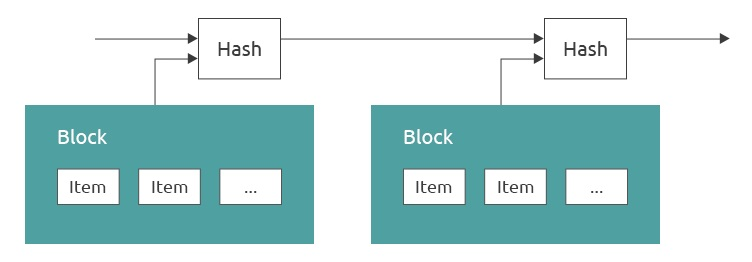

# Timestamp Server

The solution proposed requires the use of a timestamp server. We’ve already covered the concept of what a “block” is - a batch of transactions that are written to the ledger. A hash of each block is taken and announced publicly to the rest of the network to act as a timestamp server. The hash acts to provide data integrity, and publicly announcing the small amount of data to the rest of the network allows all nodes to come to agreement on a common ledger.

<figure><figcaption></figcaption></figure>
