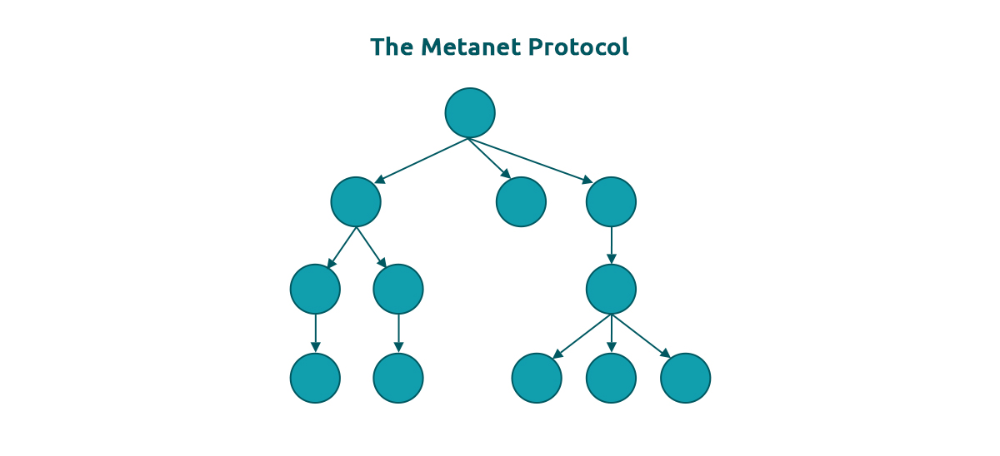
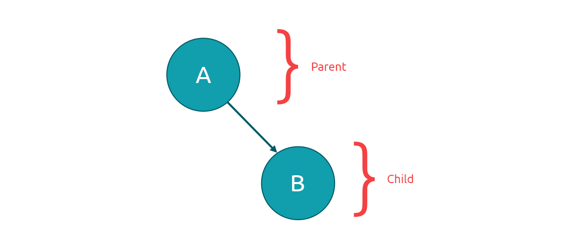

# The Metanet Protocol

<figure><figcaption></figcaption></figure>

The Metanet protocol defines various ways that we can build linked informational databases on the public ledger for use in the Metanet. These databases closely resemble the hierarchical systems used in today’s internet services, but rather than these being hosted on servers that can be attacked and taken off-line, they are written to the public ledger and become immutable records available to anyone with access to the internet. The protocol uses ECSDA signatures to form edges from child nodes back to their parents. An individual parent node can have an unbounded number of children, but the current version of the Metanet protocol limits each child to one parent, or zero parents in the case of the root node of a Metanet graph.

<figure><figcaption></figcaption></figure>

By using this simple and extensible element, we can create complex structures comprising of large numbers of connected nodes forming a database of information which can be simply and quickly scanned, validated and visualised by Metanet users.

The Metanet brings the idea of microtransactions to the fore, giving platform operators and application builders the power to manage individualised services for millions of users with microtransactions. This could include serving content, calculating computer-based outcomes or any of a multitude of other activities.

A technical summary of the protocol is available here:

[ https://bitcoinsv.io/wp-content/uploads/2020/10/The-Metanet-Technical-Summary-v1.0.pdf.](https://bitcoinsv.io/wp-content/uploads/2020/10/The-Metanet-Technical-Summary-v1.0.pdf.)

[1](https://bitcoinsv.io/wp-content/uploads/2020/10/The-Metanet-Technical-Summary-v1.0.pdf.)
