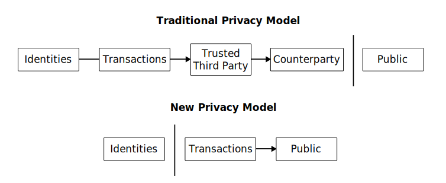

# Privacy

The traditional banking model achieves a level of privacy by limiting access to information to the parties involved and the trusted third party. The necessity to announce all transactions publicly precludes this method, but privacy can still be maintained by breaking the flow of information in another place: by keeping public keys anonymous. The public can see that someone is sending an amount to someone else, but without information linking the transaction to anyone. This is similar to the level of information released by stock exchanges, where the time and size of individual trades, the "tape", is made public, but without telling who the parties were.

As an additional firewall, a new key pair should be used for each transaction to keep them from being linked to a common owner. Some linking is still unavoidable with multi-input transactions, which necessarily reveal that their inputs were owned by the same owner. The risk is that if the owner of a key is revealed, linking could reveal other transactions that belonged to the same owner.
