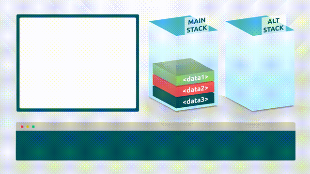
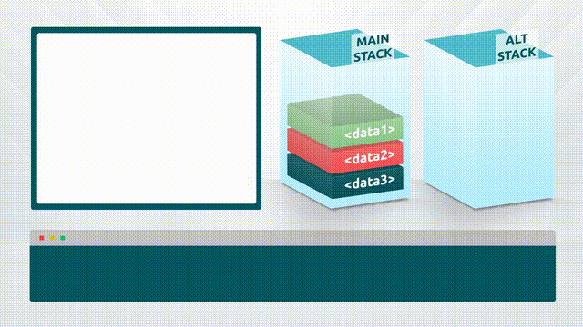
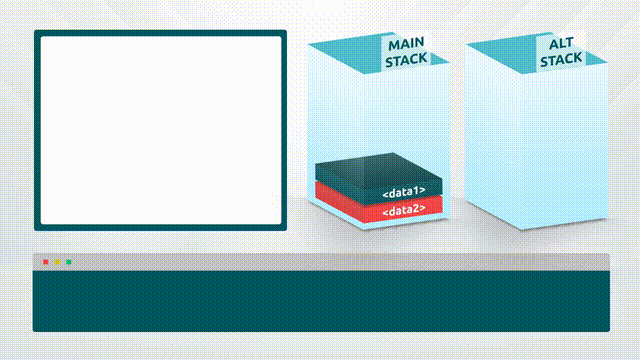
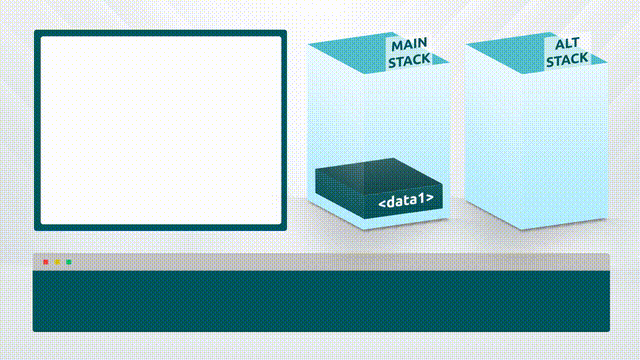

# 06 - Stack Operations

Stack operations include opcodes who's primary purpose is to process modifications to the stack, without creating any new or modified values.



### Stack Duplicators

Stack duplicators are opcodes that duplicate items at one or more locations on the stack. The Duplicators are as follows:

<table><thead><tr><th width="133">Word</th><th width="176">Input</th><th width="173">Output</th><th>Description</th></tr></thead><tbody><tr><td>OP_DUP</td><td>x</td><td>x x</td><td>Duplicates the top stack item.</td></tr><tr><td>OP_2DUP</td><td>x1 x2</td><td>x1 x2 x1 x2</td><td>Duplicates the top two stack items.</td></tr><tr><td>OP_3DUP</td><td>x1 x2 x3</td><td>x1 x2 x3 x1 x2 x3</td><td>Duplicates the top three stack items.</td></tr><tr><td>OP_IFDUP</td><td>x</td><td>x / x x</td><td>If the top stack value is not 0, duplicate it.</td></tr><tr><td>OP_OVER</td><td>x1 x2</td><td>x1 x2 x1</td><td>Copies the second-to-top stack item to the top.</td></tr><tr><td>OP_2OVER</td><td>x1 x2 x3 x4</td><td>x1 x2 x3 x4 x1 x2</td><td>Copies the pair of items two spaces back in the stack to the front.</td></tr><tr><td>OP_PICK</td><td>xn ... x2 x1 x0 &#x3C;n></td><td>xn ... x2 x1 x0 xn</td><td>The item <em>n</em> back in the stack is copied to the top.</td></tr><tr><td>OP_TUCK</td><td>x1 x2</td><td>x2 x1 x2</td><td>The item at the top of the stack is copied and inserted before the second-to-top item.</td></tr></tbody></table>

<figure><figcaption></figcaption></figure>

### Stack Eliminators

Stack eliminators are opcodes that eliminate one or more items from the stack. The eliminators are as follows:

<table><thead><tr><th width="133">Word</th><th width="78">Input</th><th width="104">Output</th><th>Description</th></tr></thead><tbody><tr><td>OP_DROP</td><td>x</td><td>Nothing</td><td>Removes the top stack item.</td></tr><tr><td>OP_2DROP</td><td>x1 x2</td><td>Nothing</td><td>Removes the top two stack items.</td></tr><tr><td>OP_NIP</td><td>x1 x2</td><td>x2</td><td>Removes the second-to-top stack item.</td></tr></tbody></table>

<figure><figcaption></figcaption></figure>

### Stack Relocators

Stack relocators are opcodes that move one or more items from their locations on the stack to a new location on the stack. The relocators are as follows:

<table><thead><tr><th width="134">Word</th><th width="177">Input</th><th width="175">Output</th><th>Description</th></tr></thead><tbody><tr><td>OP_SWAP</td><td>x1 x2</td><td>x2 x1</td><td>The top two items on the stack are swapped.</td></tr><tr><td>OP_2SWAP</td><td>x1 x2 x3 x4</td><td>x3 x4 x1 x2</td><td>Swaps the top two pairs of items.</td></tr><tr><td>OP_ROT</td><td>x1 x2 x3</td><td>x2 x3 x1</td><td>The top three items on the stack are rotated to the left.</td></tr><tr><td>OP_2ROT</td><td>x1 x2 x3 x4 x5 x6</td><td>x3 x4 x5 x6 x1 x2</td><td>The fifth and sixth items back are moved to the top of the stack.</td></tr><tr><td>OP_ROLL</td><td>xn ... x2 x1 x0 &#x3C;n></td><td>... x2 x1 x0 xn</td><td>The item <em>n</em> back in the stack is moved to the top.</td></tr></tbody></table>

<figure><figcaption></figcaption></figure>

### Alt Stack Operators

The Bitcoin Script evaluation engine has a secondary 'Altstack' available to store data as needed for calculations. There are just 2 opcodes used to interface with the altstack, one which pushes data items onto the top and one which pulls data items from the top. The Altstack operates as a LIFO (Last In First Out) buffer.

The altstack is useful for storing items for later processing that would otherwise have to be moved to the back of the stack and retrieved,&#x20;

<table><thead><tr><th width="204">Word</th><th width="81">Input</th><th width="88">Output</th><th>Description</th></tr></thead><tbody><tr><td>OP_TOALTSTACK</td><td>x1</td><td>(alt)x1</td><td>Puts the input onto the top of the alt stack. Removes it from the main stack.</td></tr><tr><td>OP_FROMALTSTACK</td><td>(alt)x1</td><td>x1</td><td>Puts the input onto the top of the main stack. Removes it from the alt stack.</td></tr></tbody></table>

<figure><figcaption></figcaption></figure>

#### Example 1:

`OP_DUP OP_1 OP_EQUAL OP_IF`

&#x20;   `OP_DROP <pubkey1> OP_CHECKSIG`

`OP_ELSE`

&#x20;   `OP_2 OP_EQUAL OP_IF`

&#x20;       `<pubkey2> OP_CHECKSIG`

&#x20;   `OP_ELSE`

&#x20;       `OP_FALSE OP_RETURN`

&#x20;   `OP_ENDIF`

`OP_ENDIF`

In this example, one of two parties can sign a transaction, and indicate which party is signing the script by appending a 1 or a 2 to their solution. This can be spent using one of the two following scriptSigs:

`<signature1> <1>`

`<signature2> <2>`

If any other value other than 1 or 2 is at the top of the stack, the script will fail.

This can be useful as it forces the signing party to indicate which key is being used within the script, allowing their identity to be captured without evaluating signatures.

#### Example 2:

`OP_2DROP <pubkey> OP_CHECKSIG`

In this example, the output being spent is used to capture data on the ledger which is not relevant to the spending of the token. This script can be validly spent using the following scriptSig:

`<signature> <data_item1> <data_item2>`

#### Example 3:

`OP_IFDUP OP_IF`

&#x20;   `<pubkey1> <pubkey2> 2 OP_CHECKMULTISIG`

`OP_ELSE`

&#x20;  `<pubkey> OP_CHECKSIG`

`OP_ENDIF`

In this example, the first loop can be entered if either 1, 2, or 3 of the signing parties required choose to sign using one of the following scriptSigs:

`<x> <signature1> <1>`

`<x> <signature2> <1>`

`<x> <signature1> <signature2> <2>`

In these solutions, the number of signatures to be checked is the last item on the stack, confirming the number of signatures needed.

To enter the second loop, the signing party would use the following scriptSig:

`<signature> <0>`

The 0 tells the script that the second entity wishes to sign using a single signature check, so there is no need to keep the value on the stack.&#x20;

#### Example 4:

`OP_OVER OP_SIZE OP_1SUB OP_SPLIT OP_NIP <sighash> OP_EQUAL OP_NOTIF`

&#x20;   `OP_FALSE OP_RETURN`

`OP_ENDIF`

In this example `OP_OVER` is used to bring the signature to the top of the stack. It's size is queried and subtracted by 1 before it is split, and the main part nipped from the stack, leaving just the SIGHASH flag which is then checked against a particular mask. If the correct SIGHASH flag is not used, the script fails. Opcodes such as `OP_SIZE`, `OP_EQUAL` and `OP_1SUB` will be covered in later parts of this chapter. For further information on the structure of DER signatures in Bitcoin, please visit [this page](https://wiki.bitcoinsv.io/index.php/Digital_signatures_in_Bitcoin).

#### Example 5:

`OP_1SUB OP_DUP OP_TOALTSTACK OP_NOTIF`

&#x20;   `2 <pubkey1> <pubkey2> 2 OP_CHECKMULTISIG`

&#x20;   `OP_FROMALTSTACK OP_DROP`

`OP_ELSE`

&#x20;   `OP_FROMALTSTACK OP_1SUB OP_NOTIF`

&#x20;       `<pubkey> OP_CHECKSIG`

&#x20;   `OP_ELSE`

&#x20;       `OP_FALSE OP_RETURN`

&#x20;   `OP_ENDIF`

`OP_ENDIF`

In this example, the spending party is one of two entities. To spend the transaction they must indicate to the script using an integer value of 1 or 2 which path they wish to take. The first entity requires a 2of2 multisignature solution which they would solve with the following scriptSig:

`<x> <signature1> <signature2> <1>`

with the first element \<x> being required due to a protocol bug (explained later), then the 2 signatures and the integer value <1> to show they wish to enter the first loop of the transaction.

By subtracting 1 from the value before duplicating it and storing the copy on the altstack, we can save space by performing a NOTIF check rather than comparing the value using `OP_1 OP_EQUAL OP_IF`. The value stored on the altstack is then pulled and dropped&#x20;

If the second entity wishes to sign, they would use the following scriptSig:

`<signature> <2>`

After the loop identifier is pulled from the altstack, a second subtraction is performed before a NOTIF check is done. In the second loop a single signature check is performed before the nested IF loops are exited.

If the top value on the stack is neither 1 nor 2, the script will enter the nested `OP_ELSE` statement where `OP_FALSE OP_RETURN` will cause it to fail.&#x20;
