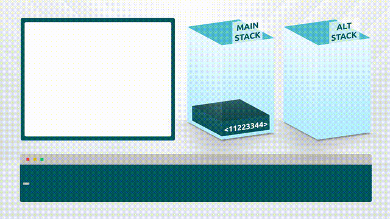

# 08 - Stack Data Queries

Stack data queries are opcodes that return information directly relating to the stack or to the data item at the top of the stack.

### Stack Depth Check

The opcode OP\_DEPTH will leave a value on the stack which indicates the depth of the stack. For example, if the stack had 3 items on it, calling OP\_DEPTH would leave the integer '3' as a new item at the top of the stack.

<table><thead><tr><th width="132">Word</th><th width="95">Input</th><th width="132">Output</th><th>Description</th></tr></thead><tbody><tr><td>OP_DEPTH</td><td>items</td><td>items, qty items</td><td>Counts the number of stack items onto the stack and places the value on the top</td></tr></tbody></table>

<figure><figcaption></figcaption></figure>

#### Example:

`OP_DEPTH OP_1 OP_EQUAL OP_IF`

`<pubkey>`

`OP_ELSE`

`OP_DUP OP_HASH160 <pubkeyhash> OP_EQUALVERIFY`

`OP_ENDIF`

`OP_CHECKSIG`

In this example, the script checks the depth of the stack. If there is just 1 item on the stack, it assumes it is a signature and checks it against a public key stored in the script. If there is more than one item on the stack, it assumes this is a public key and signature, which it checks against a stored public key hash.

### Size Query 

OP\_SIZE evaluates the first item on the stack and adds its length to the top of the stack.

<table><thead><tr><th width="118">Word</th><th width="91">Input</th><th width="103">Output</th><th>Description</th></tr></thead><tbody><tr><td>OP_SIZE</td><td>item</td><td>item, item size</td><td>Pushes the string length of the top element of the stack (without popping it).</td></tr></tbody></table>

<figure><figcaption></figcaption></figure>

#### Example:

`OP_SIZE OP_10 OP_LESSTHANOREQUAL OP_VERIFY`

In this example, the script checks that an item input to the stack is less than or equal to 10 bytes long. If the string is longer than 10 bytes long, the script fails. This can be useful when testing input conditions from user entered forms that are directly submitted to script.
