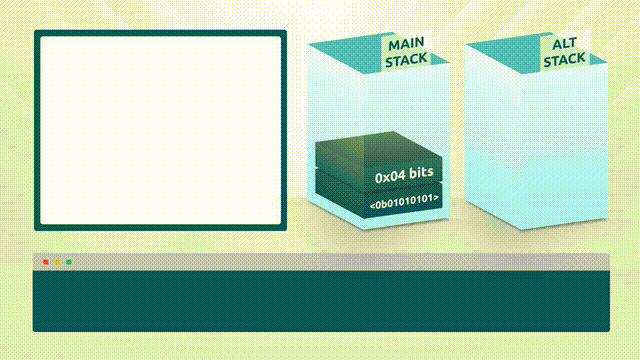

# 09 - Bitwise transformations and Arithmetic

Bitcoin Script has a full array of bitwise/binary transformation and arithmetic opcodes.

### Bitwise transformation opcodes

Bitwise transformation opcodes are used to perform bitwise transformations on data items on the stack.

<table><thead><tr><th width="140">Word</th><th width="75">Input</th><th width="122">Output</th><th>Description</th></tr></thead><tbody><tr><td>OP_INVERT</td><td>in</td><td>out</td><td>Flips all of the bits in the input.</td></tr><tr><td>OP_AND</td><td>x1 x2</td><td>out</td><td>Boolean <em>and</em> between each bit in the inputs.</td></tr><tr><td>OP_OR</td><td>x1 x2</td><td>out</td><td>Boolean <em>or</em> between each bit in the inputs.</td></tr><tr><td>OP_XOR</td><td>x1 x2</td><td>out</td><td>Boolean <em>exclusive or</em> between each bit in the inputs.</td></tr></tbody></table>

<figure><figcaption></figcaption></figure>

### Checking bitwise outcomes

To check Bitwise outcomes, the scripting language provides an equality checker. For these checks to return true, the values on the stack must be equal at a bitwise level - i.e. they must be the same value and the same size.

<table><thead><tr><th width="185">Word</th><th width="75">Input</th><th width="130">Output</th><th>Description</th></tr></thead><tbody><tr><td>OP_EQUAL</td><td>x1 x2</td><td>True / false</td><td>Returns 1 if the inputs are exactly equal, 0 otherwise.</td></tr><tr><td>OP_EQUALVERIFY</td><td>x1 x2</td><td>Nothing / <em>fail</em></td><td>Same as OP_EQUAL, but runs OP_VERIFY afterward.</td></tr></tbody></table>

<figure><figcaption></figcaption></figure>

#### Example 1:

`<0x80> OP_AND <0x80> OP_EQUALVERIFY`

This example checks that the first bit of the top stack item is 1 (`0x80 = 0b10000000`). If this condition is not met, the script will fail. The other bits are not evaluated. The top stack item must be 1 byte long or the script will fail.

#### Example 2:

`<0x7f> OP_OR <0x7f> OP_EQUALVERIFY`

This example checks that the first bit of the top stack item is 0 (`0x7F = 0b01111111`). If this condition is not met, the script will fail. The other bits are not evaluated. The top stack item must be 1 byte long or the script will fail.

#### Example 3:

`OP_XOR <0x7F> OP_OR <0xFF> OP_EQUALVERIFY`\
\
This example first applies an XOR function to two single byte values at the top of the stack. It then uses `0x7f OP_OR` to check that only one of them had the first bit set, and excludes the remaining bits from the test. If this condition is not met, the script will fail. The stack items must be 1 byte long or the script will fail.

### Arithmetic transformations

These operations perform arithmetic and other mathematical transformations on data items on the stack.&#x20;

<table><thead><tr><th width="145">Word</th><th width="88">Input</th><th width="88">Output</th><th>Description</th></tr></thead><tbody><tr><td>OP_NEGATE</td><td>in</td><td>out</td><td>The sign of the input is flipped.</td></tr><tr><td>OP_ABS</td><td>in</td><td>out</td><td>The input is made positive.</td></tr><tr><td>OP_ADD</td><td>a b</td><td>out</td><td>a is added to b.</td></tr><tr><td>OP_1ADD</td><td>in</td><td>out</td><td>1 is added to the input.</td></tr><tr><td>OP_SUB</td><td>a b</td><td>out</td><td>b is subtracted from a.</td></tr><tr><td>OP_1SUB</td><td>in</td><td>out</td><td>1 is subtracted from the input.</td></tr><tr><td>OP_NOT</td><td>in</td><td>out</td><td>If the input is 0 or 1, it is flipped. Otherwise the output will be 0.</td></tr><tr><td>OP_MUL</td><td>a b</td><td>out</td><td>a is multiplied by b.</td></tr><tr><td>OP_DIV</td><td>a b</td><td>out</td><td>a is divided by b.</td></tr><tr><td>OP_MOD</td><td>a b</td><td>out</td><td>Returns the remainder after dividing a by b.</td></tr></tbody></table>

<figure><figcaption></figcaption></figure>

#### Example 1:

`OP_DUP OP_DUP OP_MUL OP_MUL OP_ABS`

In this example, the number at the top of the stack is duplicated twice and then the three values are multiplied together to calculate the cube of the original value. The absolute value of the outcome is the final result.

#### Example 2:

`OP_DUP OP_MUL <314> OP_MUL <100> OP_DIV <1,000,000>* OP_LESSTHANOREQUAL`&#x20;

&#x20;   `OP_FALSE OP_RETURN`

`OP_ENDIF`

In this example, a trusted IoT measurement device records and reports the radius of a circle. The script uses this value to calculate the circle's area using the equation Pi x r^2. If the circle is less than 1m^2 the script fails. Note that there are no floating point calculations in Bitcoin, so 314 is used to approximate Pi (3.14) and the resulting output divided by 100 to get a figure in m^2.

\* For readability, <314>, <100> and <1,000,000> are shown as decimal numbers. To implement this example in script, the little endian integers 0x3A01, 0x64 and 0x40420F should be used respectively.&#x20;

#### Example 3:

`OP_DUP OP_SHA256 <1,000,000>* OP_MOD OP_NOTIF`

&#x20;   `<1>`

`OP_ELSE`

&#x20;   `<2>`

`OP_ENDIF`

`<pubkey1> <pubkey2> <2> OP_CHECKMULTISIG`

\* For readability <1,000,000> is shown as a decimal number. To implement this example in script, the little endian integer 0x40420F should be used.&#x20;

In this example, the signing parties play a game where the first to find a signature that with a SHA256 hash that is divisible by 1 million can spend the output. To begin the game, the coin is spent into a non-final script using both keys which pays out equally. If one user finds a valid solution before the time expires, they can finalise the payment channel and spend the full amount to their own wallet.

Valid solutions to the script are as follows:

`<x> <signature 1>` (where signature 1 is divisible by 1,000,000)

`<x> <signature 2>` (where signature 2 is divisible by 1,000,000)

`<x> <signature 1> <signature 2>`

### Boolean Shifts

Boolean shifts are used to shift the bits within a data item on the stack. There is no limit to the size of data item that these opcodes can be applied to.

<table><thead><tr><th width="273">Word</th><th width="88">Input</th><th width="88">Output</th><th>Description</th></tr></thead><tbody><tr><td>OP_LSHIFT</td><td>a b</td><td>out</td><td>Logical left shift b bits. Sign data is discarded</td></tr><tr><td>OP_RSHIFT</td><td>a b</td><td>out</td><td>Logical right shift b bits. Sign data is discarded</td></tr></tbody></table>

<figure><figcaption></figcaption></figure>

### Boolean Data Checks

These opcodes check inputs against Boolean and/or conditions. In all cases, any non-zero value is considered a true/1, while a zero value of any length bytevector is considered a false/0.&#x20;

<table><thead><tr><th width="273">Word</th><th width="88">Input</th><th width="88">Output</th><th>Description</th></tr></thead><tbody><tr><td>OP_BOOLAND</td><td>a b</td><td>out</td><td>If both a and b are not 0, the output is 1. Otherwise 0.</td></tr><tr><td>OP_BOOLOR</td><td>a b</td><td>out</td><td>If a or b is not 0, the output is 1. Otherwise 0.</td></tr></tbody></table>

<figure><figcaption></figcaption></figure>

### Arithmetic value checks

These opcodes allow the script to check stack values against pre-set/expected results to create complex functionality.&#x20;

<table><thead><tr><th width="273">Word</th><th width="88">Input</th><th width="95">Output</th><th>Description</th></tr></thead><tbody><tr><td>OP_NUMEQUAL</td><td>a b</td><td>out</td><td>Returns 1 if the numbers are equal, 0 otherwise.</td></tr><tr><td>OP_NUMEQUALVERIFY</td><td>a b</td><td>Nothing / <em>fail</em></td><td>Same as OP_NUMEQUAL, but runs OP_VERIFY afterward.</td></tr><tr><td>OP_NUMNOTEQUAL</td><td>a b</td><td>out</td><td>Returns 1 if the numbers are not equal, 0 otherwise.</td></tr><tr><td>OP_LESSTHAN</td><td>a b</td><td>out</td><td>Returns 1 if a is less than b, 0 otherwise.</td></tr><tr><td>OP_GREATERTHAN</td><td>a b</td><td>out</td><td>Returns 1 if a is greater than b, 0 otherwise.</td></tr><tr><td>OP_LESSTHANOREQUAL</td><td>a b</td><td>out</td><td>Returns 1 if a is less than or equal to b, 0 otherwise.</td></tr><tr><td>OP_GREATERTHANOREQUAL</td><td>a b</td><td>out</td><td>Returns 1 if a is greater than or equal to b, 0 otherwise.</td></tr></tbody></table>

<figure><figcaption></figcaption></figure>

### Max, Min and Within

These opcodes allow the script to select a maximum or minimum value from a group, or to discover whether a value is within a range.&#x20;

<table><thead><tr><th width="139">Word</th><th width="111">Input</th><th width="88">Output</th><th>Description</th></tr></thead><tbody><tr><td>OP_MIN</td><td>a b</td><td>out</td><td>Returns the smaller of a and b.</td></tr><tr><td>OP_MAX</td><td>a b</td><td>out</td><td>Returns the larger of a and b.</td></tr><tr><td>OP_WITHIN</td><td>x min max</td><td>out</td><td>Returns 1 if x is within the specified range (left-inclusive), 0 otherwise.</td></tr></tbody></table>

<figure><figcaption></figcaption></figure>
