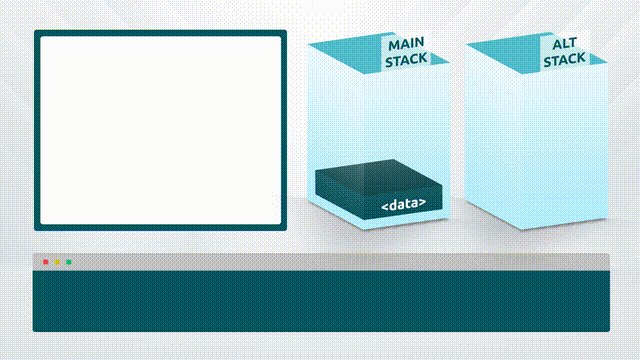
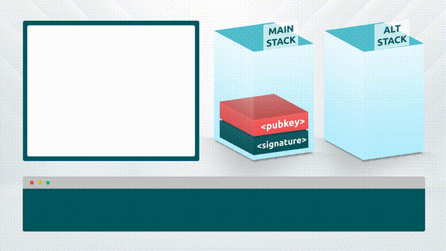

# 10 - Cryptographic Functions

Bitcoin script includes a range of cryptographic functions such as hashing functions and ECDSA signature checks.

### Hash Functions

<figure><figcaption></figcaption></figure>

There are three hash functions available in Bitcoin script:

1. RIPEMD160
2. SHA1
3. SHA256

There are also opcodes that perform double hash operations using these same base opcodes.

Each hash function consumes the topmost data item on the stack and replace it with the hash of that data item.

<table><thead><tr><th width="214">Word</th><th width="117">Input</th><th width="118">Output</th><th>Description</th></tr></thead><tbody><tr><td>OP_RIPEMD160</td><td>in</td><td>hash</td><td>The input is hashed using RIPEMD-160.</td></tr><tr><td>OP_SHA1</td><td>in</td><td>hash</td><td>The input is hashed using SHA-1.</td></tr><tr><td>OP_SHA256</td><td>in</td><td>hash</td><td>The input is hashed using SHA-256.</td></tr><tr><td>OP_HASH160</td><td>in</td><td>hash</td><td>The input is hashed twice: first with SHA-256 and then with RIPEMD-160.</td></tr><tr><td>OP_HASH256</td><td>in</td><td>hash</td><td>The input is hashed two times with SHA-256.</td></tr></tbody></table>

### ECDSA Signature Check Functions

<figure><figcaption></figcaption></figure>

Bitcoin script provides users with both single and multisignature options based on the Secp256k1 elliptic curve. These functions are core to the Peer to Peer functionality of Bitcoin, allowing users to assert ownership of coins when transacting.

It is important to understand that digital signatures alone cannot be used to establish identity, and there is an implicit requirement for users on each side of a transaction to take responsibility for checking/proving counterparty identity, and then using digital signatures to finalise the transactions.

The messages used to generate the signatures are created using reproducible data, which allows the nodes on the network to perform signature checks using only the transaction data itself. This is a key element of Bitcoin's peer-to-peer functionality, and allowing nodes to perform independent signature validations without user input.

<table data-header-hidden><thead><tr><th width="215"></th><th></th><th></th><th></th></tr></thead><tbody><tr><td>Word</td><td>Input</td><td>Output</td><td>Description</td></tr><tr><td>​<a href="https://wiki.bitcoinsv.io/index.php/OP_CHECKSIG">OP_CHECKSIG</a>​</td><td>sig pubkey</td><td>True / false</td><td>The entire transaction's outputs, inputs, and script (from the most recently-executed OP_CODESEPARATOR to the end) are hashed. The signature used by OP_CHECKSIG must be a valid signature for this hash and public key. If it is, 1 is returned, 0 otherwise.</td></tr><tr><td>OP_CHECKSIGVERIFY</td><td>sig pubkey</td><td>Nothing / <em>fail</em></td><td>Same as OP_CHECKSIG, but OP_VERIFY is executed afterward.</td></tr><tr><td>OP_CHECKMULTISIG</td><td>x sig1 sig2 ... &#x3C;n> pub1 pub2 ... &#x3C;m></td><td>True / False</td><td>Compares the first signature against each public key until it finds an ECDSA match. Starting with the subsequent public key, it compares the second signature against each remaining public key until it finds an ECDSA match. The process is repeated until all signatures have been checked or not enough public keys remain to produce a successful result. All signatures need to match a public key. Because public keys are not checked again if they fail any signature comparison, signatures must be placed in the scriptSig using the same order as their corresponding public keys were placed in the scriptPubKey or redeemScript. If all signatures are valid, 1 is returned, 0 otherwise. Due to a bug, an extra unused value (x) is removed from the stack. Script spenders must account for this by adding a junk value (typically zero) to the stack.</td></tr><tr><td>OP_CHECKMULTISIGVERIFY</td><td>x sig1 sig2 ... &#x3C;n> pub1 pub2 ... &#x3C;m></td><td>Nothing / <em>fail</em></td><td>Same as OP_CHECKMULTISIG, but OP_VERIFY is executed afterward.</td></tr></tbody></table>

#### OP\_CODESEPARATOR 

<figure><figcaption></figcaption></figure>

`OP_CODESEPARATOR` is used in a Bitcoin script to indicate to the node checking the signature exactly which part of the scriptPubKey is being signed. When transactions are submitted to the network, the node inserts `OP_CODESEPARATOR` at the junction between input and output.\
\
When the transaction validation engine reaches an ECDSA checking function, the message that it uses to perform the signature check only includes the script that comes after the most recent `OP_CODESEPARATOR` in the scriptPubKey being signed.\
\
This functionality can be used in complex scripts to allow users to omit parts of the transaction output being signed, which can be useful when building complex functionality such as contracts with signature witness statements

<table data-header-hidden><thead><tr><th width="215"></th><th></th><th></th><th></th></tr></thead><tbody><tr><td>Word</td><td>Input</td><td>Output</td><td>Description</td></tr><tr><td>​<a href="https://wiki.bitcoinsv.io/index.php/OP_CODESEPARATOR">OP_CODESEPARATOR</a>​</td><td>Nothing</td><td>Nothing</td><td>All of the signature checking words will only match signatures to the data after the most recently-executed OP_CODESEPARATOR.</td></tr></tbody></table>

**Example: Masked document for witness signature**

scriptSig: `<witness_signature> <witness_public_key> <witness_name> <signatory_signature>`

scriptPubKey: `OP_CODESEPARATOR <hash_contract> OP_DROP <signatory_public_key> OP_CHECKSIGVERIFY OP_CODESEPARATOR <witness_statement> OP_2DROP OP_CHECKSIG`\
\
In this example, an output is created containing a contract document that is ready to be signed into effect as well as a witness statement allowing a third party to attest that they witnessed the signing party performing the contract signature.

The scriptSig contains 4 elements. First, the witness signature, public key and name are added, then the signing party's signature.\
\
The first `OP_CODESEPARATOR` is inserted by the validation engine when the transaction scriptSig and scriptPubKey are joined. The scriptSig contains both the witness signature and signatory signature. During the validation processs, a hash of the document being signed (`<hash_contract>`) is pushed onto the stack and dropped before the signatory's public key is pushed onto the stack and their signature checked using `OP_CHECKSIGVERIFY`. When OP\_CHECKSIGVERIFY is processed, the message signed by the signature must include the scriptPubKey all the way back to the first `OP_CODESEPARATOR` which includes the contract, their public key and the witness statement.\
\
After the first OP\_CHECKSIGVERIFY, `OP_CODESEPARATOR` is used.

The script then pushes a witness statement onto the stack, drops it and the witness' name, and then checks their signature against the public key they provided. Again, the message in the signature includes the script as far back as the most recent OP\_CODESEPARATOR. This means that the message signed by the witness does not include the contract itself, allowing the witness to act as a witness of the signing party's identity and signature only. This can be likened to showing the witness the signing page of a contract and letting them watch you sign, but keeping the remainder private.
