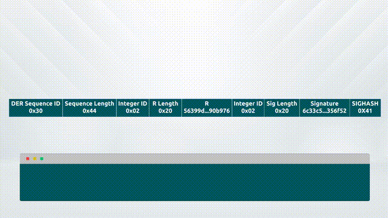

# 06 - R-Puzzles

R-Puzzles are a means by which the ephemeral key used in the calculation of an elliptic curve signature can be applied to a locking function. R-Puzzles provide additional capabilities to users of the Bitcoin protocol by allowing parties to provide the ephemeral keys to third parties to access specific outputs on the blockchain so that valid signatures can be created.

To achieve this, the R-Puzzle script breaks down a signature in Bitcoin's modified DER format and extracts the R-value, before evaluating it against a value stored in the output script. The Bitcoin DER format is as follows:

<table><thead><tr><th width="214.33333333333331">Data Item</th><th>Example data / notes</th></tr></thead><tbody><tr><td>Sequence Identifier</td><td>0x30</td></tr><tr><td>Length of Sequence</td><td>0x44 (Variable length, max value 0x46)</td></tr><tr><td>Integer Identifier</td><td>0x02</td></tr><tr><td>Byte-length of r</td><td>0x20 (Variable length, max value 0x21)</td></tr><tr><td>r</td><td>e9d34347e597e8b335745c6f8353580f4cbdb4bcde2794ef7aab915d996642 (Must not be negative)</td></tr><tr><td>Integer identifier</td><td>0x02</td></tr><tr><td>Byte-length of s</td><td>0x20 (Variable length, max value 0x21)</td></tr><tr><td>s</td><td>4f2ccb52c7243c55bde34934bd55efbdac21c74a20bb7b438d1b6de3311f (Low signature coordinate only)</td></tr><tr><td>Sighash type</td><td>0x41 (SIGHASH_ALL | SIGHASH_FORKID)</td></tr></tbody></table>

<figure><figcaption></figcaption></figure>

An R-Puzzle script is defined as follows:

`OP_3 OP_SPLIT OP_NIP OP_1 OP_SPLIT OP_SWAP OP_SPLIT OP_DROP <r-value> OP_EQUAL`

<figure><figcaption></figcaption></figure>

### Pay to R-Puzzle Hash

This script does not include a signature evaluation so a further extension combines a signature check and hash function into a script called Pay to R-Puzzle Hash (P2RPH).

A P2RPH script is defined as follows:

`OP_OVER OP_3 OP_SPLIT OP_NIP OP_1 OP_SPLIT OP_SWAP OP_SPLIT OP_DROP OP_HASH160 <r_hash> OP_EQUALVERIFY OP_CHECKSIG`

To spend an output that is locked with a P2RPH script, the following solution is provided:

`<signature> <public_key>`

The validation engine will evaluate the full script as follows:

`<signature> <public_key> OP_OVER OP_3 OP_SPLIT OP_NIP OP_1 OP_SPLIT OP_SWAP OP_SPLIT OP_DROP OP_HASH160 <r_hash> OP_EQUALVERIFY OP_CHECKSIG`

A breakdown of the script evaluation process is shown below:

<table><thead><tr><th width="208.33333333333331">Stack</th><th width="286">Script</th><th>Description</th></tr></thead><tbody><tr><td>Empty.</td><td>
&#x3C;sig> &#x3C;pubKey> | |

OP_OVER OP_3 OP_SPLIT OP_NIP OP_1 OP_SPLIT OP_SWAP OP_SPLIT OP_DROP OP_HASH160 &#x3C;r_hash> OP_EQUALVERIFY OP_CHECKSIG
</td><td>scriptSig and scriptPubKey are combined.</td></tr><tr><td>&#x3C;sig> &#x3C;pubKey></td><td>OP_OVER OP_3 OP_SPLIT OP_NIP OP_1 OP_SPLIT OP_SWAP OP_SPLIT OP_DROP OP_HASH160 &#x3C;r_hash> OP_EQUALVERIFY OP_CHECKSIG</td><td>Signature and public key are added to the stack</td></tr><tr><td>&#x3C;sig> &#x3C;pubKey> &#x3C;sig></td><td>OP_3 OP_SPLIT OP_NIP OP_1 OP_SPLIT OP_SWAP OP_SPLIT OP_DROP OP_HASH160 &#x3C;r_hash> OP_EQUALVERIFY OP_CHECKSIG</td><td>Signature is copied to top of stack.</td></tr><tr><td>&#x3C;sig> &#x3C;pubKey> &#x3C;sig> 3</td><td>OP_SPLIT OP_NIP OP_1 OP_SPLIT OP_SWAP OP_SPLIT OP_DROP OP_HASH160 &#x3C;r_hash> OP_EQUALVERIFY OP_CHECKSIG</td><td>Constant value '3' is added to top of stack.</td></tr><tr><td>&#x3C;sig> &#x3C;pubKey> &#x3C;sig_l3> &#x3C;sig_r></td><td>OP_NIP OP_1 OP_SPLIT OP_SWAP OP_SPLIT OP_DROP OP_HASH160 &#x3C;r_hash> OP_EQUALVERIFY OP_CHECKSIG</td><td>First 3 bytes of DER encoded signature are split from remainder</td></tr><tr><td>&#x3C;sig> &#x3C;pubKey> &#x3C;sig_r></td><td>OP_1 OP_SPLIT OP_SWAP OP_SPLIT OP_DROP OP_HASH160 &#x3C;r_hash> OP_EQUALVERIFY OP_CHECKSIG</td><td>First 3 bytes of DER encoded signature are removed from stack</td></tr><tr><td>&#x3C;sig> &#x3C;pubKey> &#x3C;sig_r> 1</td><td>OP_SPLIT OP_SWAP OP_SPLIT OP_DROP OP_HASH160 &#x3C;r_hash> OP_EQUALVERIFY OP_CHECKSIG</td><td>Constant value '1' is added to stack</td></tr><tr><td>&#x3C;sig> &#x3C;pubKey> &#x3C;r_len> &#x3C;sig_r></td><td>OP_SWAP OP_SPLIT OP_DROP OP_HASH160 &#x3C;r_hash> OP_EQUALVERIFY OP_CHECKSIG</td><td>The length of r is split from the signature remainder</td></tr><tr><td>&#x3C;sig> &#x3C;pubKey> &#x3C;sig_r> &#x3C;r_len></td><td>OP_SPLIT OP_DROP OP_HASH160 &#x3C;r_hash> OP_EQUALVERIFY OP_CHECKSIG</td><td>Length of r is moved to top of stack</td></tr><tr><td>&#x3C;sig> &#x3C;pubKey> &#x3C;r> &#x3C;sig_r></td><td>OP_DROP OP_HASH160 &#x3C;r_hash> OP_EQUALVERIFY OP_CHECKSIG</td><td>r value is split from signature remainder</td></tr><tr><td>&#x3C;sig> &#x3C;pubKey> &#x3C;r></td><td>OP_HASH160 &#x3C;r_hash> OP_EQUALVERIFY OP_CHECKSIG</td><td>Signature remainder is dropped from stack</td></tr><tr><td>&#x3C;sig> &#x3C;pubKey> &#x3C;hash160_r></td><td>&#x3C;r_hash> OP_EQUALVERIFY OP_CHECKSIG</td><td>r value is hashed using OP_HASH160</td></tr><tr><td>&#x3C;sig> &#x3C;pubKey> &#x3C;hash160_r> &#x3C;r_hash></td><td>OP_EQUALVERIFY OP_CHECKSIG</td><td>Expected r-hash is added to the stack</td></tr><tr><td>&#x3C;sig> &#x3C;pubKey></td><td>OP_CHECKSIG</td><td>Expected r-hash is tested for equality against generated r-hash</td></tr><tr><td>true</td><td>Empty.</td><td>The signature is checked against the public key</td></tr></tbody></table>

As shown above, the spending party must supply a valid signature generated from the public key also provided. Because we don't check the public key, this signature can be generated with any valid public key. The script copies the signature to the top of the stack before extracting the length of the r component, and using this length value to extract r itself. Once r has been separated from the signature, it is hashed and checked against an expected value before the signature is checked for validity against the public key provided. A wallet using R-Puzzles must keep a list of k-values which it needs to sign R-Puzzle inputs. These are mathematically identical to ECDSA public keys.

R-Puzzles can form a useful component of other second layer functionality and can be incorporated into more elaborate scripts for added functionality.
