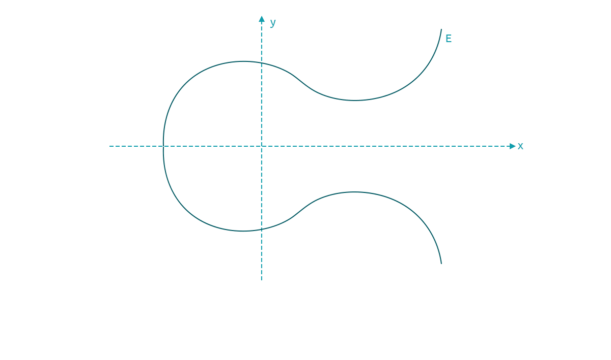

# Discrete Logarithm Problem with Elliptic Curves

Consider an elliptic curve $$E$$, with generator $$G$$ and another element $$T$$. Then DLP is finding $$d$$, such that

> $$G+G+G+...+G$$ $$(d \ times)$$ $$= d*G = T$$

To understand the practical implications, we visualize this geometrically on the curve $$E$$ :- we first find generator $$G$$ on $$E$$, then add $$G$$ to it to locate $$2G$$.&#x20;

This is considered the first hop (computationally, it is executing the group operation). Then, we add $$G$$ again to mark the value of $$3G$$, which is the second hop. By repeating this process, $$d$$ times, we finally reach point $$T$$ on the curve $$E$$.&#x20;

As it turns out, finding the number of hops is computationally hard.

So, the starting point is known for elliptic curves, i.e., the generator $$G$$, the final point is known, $$T$$, then DLP is essentially to find the number of hops taken to reach $$T$$ from $$G$$.

<mark style="background-color:orange;">IMPORTANT</mark> Note - for elliptic curves, we use the discrete logarithm problem as:

> $$d$$ is private key and $$T$$ is the public key \
> $$d=K_{pr}$$  - an integer, which is the number of hops in above explanation \
> $$T = dG = K_{pub}$$    This is a point on curve $$E$$, i.e., group element, i.e., it has an $$x$$ and $$y$$ co-ordinate so $$T = ( x_T, y_T )$$&#x20;

As we define $$d$$ as the private key and $$T$$ as the public key, the practical implication of the above is that given a known public key, it is very hard to compute the private key.

_Terminology note_ - Generator is also commonly referred to as "base point", so $$G$$ is a base point for curve $$E$$.&#x20;

**Credits**

Special thanks to Prof. Christof Paar for providing a fantastic [Introduction to Cryptography](https://www.youtube.com/channel/UC1usFRN4LCMcfIV7UjHNuQg).
