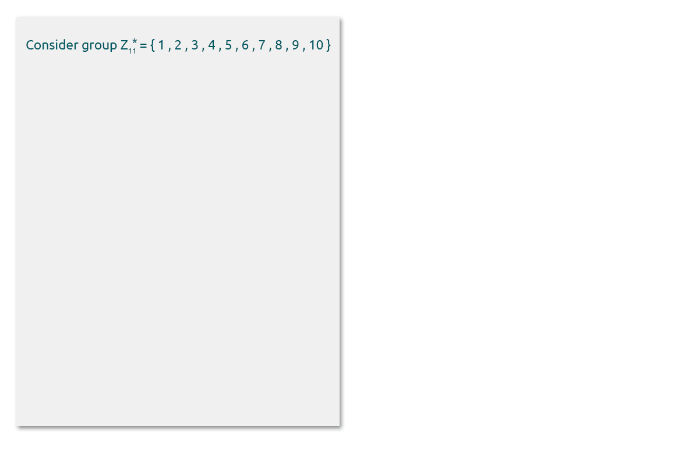
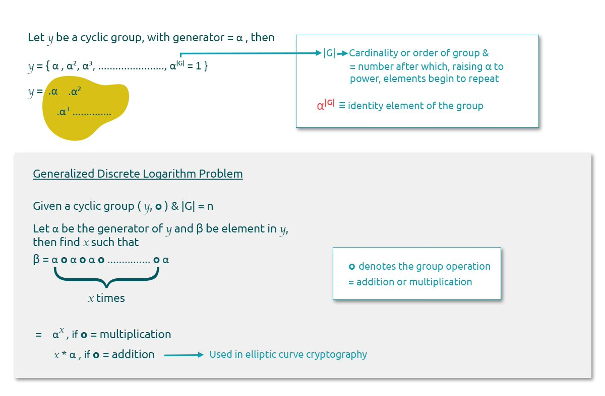

# Discrete Logarithm Problem

This lesson contains quite a few definitions written conceptually so as to resonate with the terminology which is applied to ECDSA.

Cyclic groups form the basis of discrete logarithm cryptosystems.

In very non-mathematical terms, a group is considered as a cyclic group when elements start repeating themselves after a certain known number. They have an essential property which is the "Generator" of the group, explained below -

**Generator of the group** - Consider a group $$G$$. An element $$g$$ of the group is called the generator if $$g$$ can generate the entire group, i.e., every element $$a$$ of $$G$$ can be written as $$g^i$$, i.e., $$g^i=a$$

The generator has practical implications and is used extensively for cryptosystems. Let us attempt to understand this using an example.

$$z_{11}$$ is a cyclic group and where $$g$$ denotes the generator.&#x20;

Let $$β$$ be an element of $$z_{11}$$, then $$g^x ≡ β \ mod \ 11$$. Finding the $$x$$ involves the same process as solving the Discrete Logarithm Problem. Under certain conditions, it is computationally hard to solve the equation for $$x$$ and hence this property can be leveraged and considered a security measure.

**Discrete Logarithm Problem** - Recall from elementary mathematics where in order to compute the exponent, we need to perform the logarithm. Hence, the name of the Discrete Logarithm Problem (DLP).

Let $$p$$ and $$β$$ be elements of $$Z_p*$$, with generator $$g$$.&#x20;

We define the DLP in this instance as - find $$x$$ such that $$g^x ≡ β \ mod \ p$$&#x20;

When $$p$$ is large enough, finding $$x$$ in the above equation is computationally hard to solve.&#x20;

**Generalised Discrete Logarithm Problem** - One of the features of the DLP is that it is not restricted to $$Z_p*$$ but can be defined over any cyclic group. This makes it extremely useful in building crypto systems and why it is therefore used in ECDSA as well.

