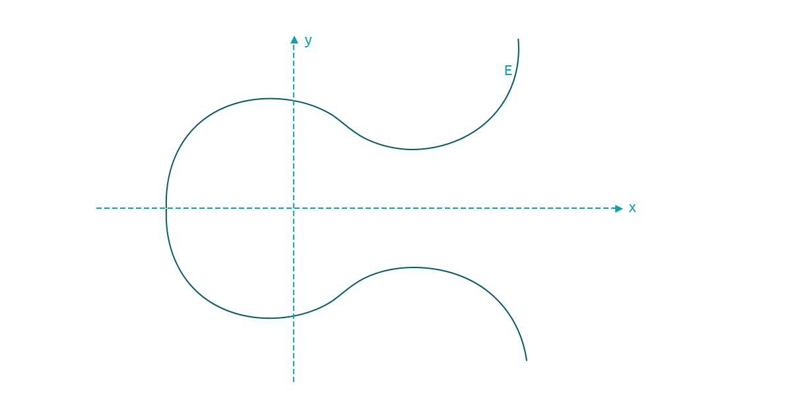
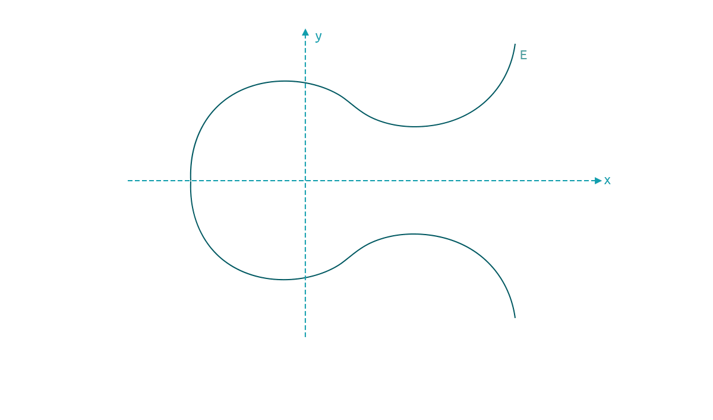

# Elliptic Curve Cryptography (ECC)

There are many available choices for asymmetric cryptography, such as RSA or DLP-based cryptosystems. However, ECC has an edge over others in that it requires a shorter length keys than other cryptosystems to provide a similar security level. For example, where RSA, DLP-based cryptosystems require a key of 1024-2048 bits, we will need a key length of only 160-256 bits for ECC. Being able to use shorter key lengths with ECC means we get shorter digital signatures.

For cryptography, an elliptic curve is a particular type of polynomial equation constructed over a finite field. Prime fields, _denoted as_ $$GF(p)$$ _(after the name of mathematician Galois),_ are the most popular choice of finite fields, where all arithmetic is performed over modulo prime $$p$$.

The elliptic curve equation in a finite field is:

> $$y^2≡x^3+ax+b \ mod \ p:p>3 \ and \ a,b \ are \ elements \ of \ Z_p$$&#x20;
>
> <mark style="background-color:blue;">Special consideration to note:</mark>&#x20;
>
> &#x20; $$a$$, $$b$$ and $$p$$ are required to satisfy the condition $$4a^3+27b^2 \ mod \ p ≠0$$&#x20;
>
> We consider an imaginary point of infinity $$Φ$$ (this is simply an identity element)

To visualise the above equation and understand a few operations, we must make use of coordinate geometry.&#x20;

<mark style="background-color:blue;">Note - plotting the above graph defined with</mark> $$Z_p$$<mark style="background-color:blue;">does not give us a curve, but rather a set of discrete points instead.</mark>&#x20;

Therefore to demonstrate some ideas in the following examples, we construct the graph over a set of real numbers which yields a complete curve.

###

## Group Operations

We mentioned the identity element above, and now, below is a high-level overview of group operations.

### Point Doubling

To add points $$P$$ and $$Q$$, we do the following steps:&#x20;

1. Draw a line joining $$P$$ and $$Q$$ and extend it until it intersects the curve. This point of intersection will be the negative of the sum $$P+Q$$
2. Therefore the mirror image about the x-axis of the point of intersection on the curve gives us the value of $$P+Q$$

.gif>)

**Special Case I -** When $$Q=P$$, then what is $$P+Q$$, i.e., $$P+P$$?&#x20;

The way to visualise this is to keep moving $$Q$$ closer and closer to $$P$$ and observe that the line will become a tangent at point $$P$$. Extend this line to intersect the curve. The mirror image about the x-axis is the value of $$P+P$$, i.e., $$2P$$. This first special case is referred to as Point Doubling.

**Special Case II -** When $$Q=-P$$ in other words, $$Q$$ is inverse of $$P$$, $$P+Q$$​ is the identity element (imaginary point $$Φ$$ at infinity)

**Special Case III -** When $$P=(x,0)$$, then $$P+P$$ is equal to the identity element $$Φ$$

_<mark style="background-color:blue;">Note:</mark>_

<mark style="background-color:blue;">i. The rationale to perform addition ensures that the set of points on the elliptic curve, satisfies the necessary condition for a group.</mark>

<mark style="background-color:blue;">ii. Generalizing above, in real-world applications, point addition is achieved by finding the slope of the line and solving the cubic equation.</mark>

### Inverse

Is considered as a mirror image of the point on the curve. Identity is already mentioned above.

### Scalar Multiplication

Scalar Multiplication is defined as multiplying point $$P$$ with scalar $$n$$ is essentially 'adding a point to itself $$n$$ times.'

$$nP = P+P+ …..+P (n \ times)$$

Scalar Multiplication is achieved by using Point Addition and Point Doubling. The algorithm used for Scalar Multiplication is included below; however, it is an optional topic. The algorithm is used for computing public keys in ECDSA

### Square-and-Multiply Algorithm

Scalar Multiplication makes use of the "square-and-multiply algorithm." The difference is square is replaced by Point Doubling and multiply by Point Addition.

Convert the scalar value into a binary representation. Start from (MSB - 1) position and iterate till LSB (_MSB stands for "Most significant bit" and LSB stands for_ _"Least significant bit"_).&#x20;

If in the iteration a bit is 0, then perform Point Doubling; if the bit is 1, then perform Point Doubling and Point Addition. For MSB, we don't perform any operation and consider the value as-is.&#x20;

Let's say we want to find a value of $$11P$$. First we need to convert decimal into binary representation:\
\
$$11P$$ = $$(1011)_2P=(d_3d_2d_1d_0)_2P$$ &#x20;

Scan the bits on MSB i.e., $$d_3$$ and go till LSB $$d_0$$

\
<mark style="background-color:blue;">Iteration 0:</mark>\
$$P = 1_2 P$$                                                initial setting, bit processed: $$d_3 = 1$$ \
\---------------------------- \
<mark style="background-color:purple;">Iteration 1a:</mark>\
$$P + P = 2P = 10_2 P$$                           point double, bit processed: $$d_2 = 0$$ \
<mark style="background-color:purple;">Iteration 1b:</mark>                                                           no point addition, as $$d_2 = 0$$  \
\---------------------------- \
<mark style="color:orange;background-color:orange;">Iteration 2a:</mark>   \
$$2P  + 2P =  4P = 2(10_2 P )=  100_2 P$$                          point double: $$d_1 =1$$\
<mark style="background-color:orange;">Iteration 2b:</mark>   \
$$4P + P = 5P = 101_2 P$$                                                 point add, as $$d_1 = 1$$ \
\--------------------------- \
<mark style="background-color:red;">Iteration 3a:</mark>    \
$$5P + 5P = 10 P = 2(101_2 P ) = 1010_2 P$$                    point double: $$d_0 = 1$$\
<mark style="background-color:red;">Iteration 3b:</mark>    \
$$10P + P = 11P = 1011_2 P$$                                                point add: $$d_0 = 1$$

When we define the elliptic curve as above, under certain conditions the set of points and the identity element form a cyclic group. Firstly, the formation of a cyclic group implies the set must have a generator, i.e., an element in the set, such that its powers generate the entire group. Secondly, it leads to the next and last topic of pre-requisites.
