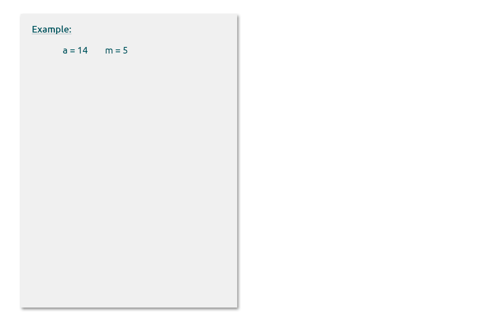

# Modular Arithmetic

Modular arithmetic leads to the formation of equivalence classes, which makes it extremely useful in cryptography. Furthermore, the property of equivalence class - "**all the members of the given equivalence class behave equivalently**" enables practical implications.

Specifically, it makes computations, such as exponentiation, for large numbers feasible.

An example of an equivalence class could be to say "All green cars are green".

We define Modulo Operation (over a set of integers) as

> a≡ r mod m, if m divides a - r. In other words, r is the remainder when a is divided by m. Here a,r,m are integers and m >0. m is called the modulus

For example, 9 ≡ 4 mod 5, i.e., when 9 is divided by 5, it leaves a remainder of 4.

If we start looking at numbers abstractly, it would be interesting to note this remainder is not unique, i.e., 14 ≡ 4 mod 5, 4 ≡ 4 mod 5, -1 ≡ 4 mod 5. So, we can say, \[.....,-1, 4, 9, 14,.....] form an equivalence class.&#x20;

If we keep repeating this exercise with more integers, we will arrive at a pattern. The pattern is :- when mod 5 is applied to all the integers, the result will belong to either one of the equivalence classes - \[0],\[1],\[2],\[3],\[4].

Modular Arithmetic is sometimes called clock arithmetic as numbers wrap around when reaching a certain value (12 in the case of a clock).

The specific example above can be further generalised, to the degree such that we can infer that:- **over a set of integers, mod n will lead to distinct equivalence classes - \[0],\[1],\[2],\[3],\[4],.....,\[n-1]**
