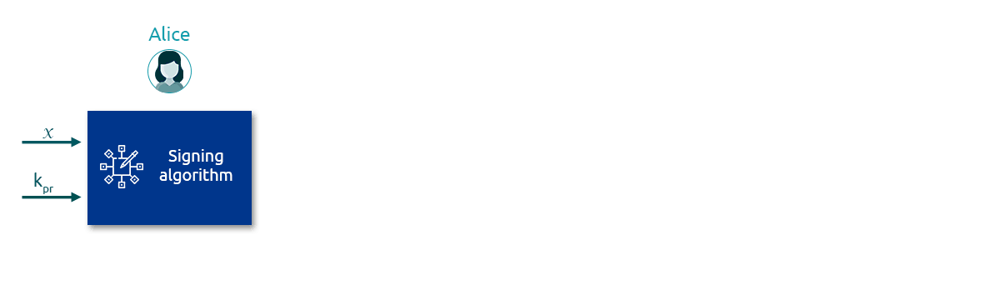

# Digital Signatures Protocol

### Digital Signatures Protocol

Consider a document that needs to be digitally signed. For simplicity, we will use two parties - Alice signing the document and Bob verifying the document. Let us now look at the steps for signing and verification with the Digital Signatures protocol as a high-level abstract level abstraction.

**Step 1 - Generating an asymmetric private/public key pair**

The party that wants to sign a document digitally generates a private key, which is used to compute a public key. While the private key is used for signing and must be kept secret, the public key is shared with the counter party who wants to use it to verify the signature. The public key allows the signature to be verified without needing to share the private key.

In our example, Alice generates a key pair - $$k_{pr}$$and $$k_{pub}$$

There are a few essential properties for this key pair:

1. $$k_{pr}$$ and $$k_{pub}$$ have a mathematical relationship. Said in other words, these keys are not independent of each other, and Bob needs to use $$k_{pub}$$ to verify the document signed by Alice using $$k_{pr}$$
2. The association between $$k_{pr}$$ and $$k_{pub}$$ is such that it is easy to generate $$k_{pub}$$ when $$k_{pr}$$ is known. However, generating $$k_{pr}$$ from $$k_{pub}$$ is computationally infeasible.&#x20;
3. The knowledge of $$k_{pr}$$, being secret, works as a mechanism for providing message authentication and non-repudiation (these two properties are discussed in the next lesson).
4. Typically, an accessible registry such as a public website is used to publish the public key $$k_{pub}$$. This allows Alice to associate her identity with the public key, allowing anyone to check a signature against the public key and verify it is hers.

**Step 2 - Signing**&#x20;

The signing of the document involves applying a mathematical transformation to the contents of the document.

The inputs to the 'signing algorithm' are the content of documents, which we shall call $$x$$, and the private key $$k_{pr}$$. The output is the digital signature itself, which we shall call, $$y$$.

$$sig \ k_{pr}\ x = y$$&#x20;

_Note:_

1. The document's content is also referred to as "message" and can be encoded as hexadecimal, string of bytes etc.
2. In real-world applications, digital signatures are applied on the output after the 'message' has been passed through a hash function, yielding a fixed-length output for an arbitrary length 'message'. A hash function is either applied explicitly or as a part of the signature algorithm.

**Step 3 - Verification**

The 'verification algorithm' takes three inputs - the document's contents $$x$$, the digital signature $$y$$, and the public key $$k_{pub}$$. The output  from the verification algorithm will be a Boolean value of either True or False, i.e., a bit value 1/0.

#### End to End Protocol

Alice generates a private and public key pair for herself and shares the public key with Bob. The idea here is that public keys can be easily distributed and made available to all, via publishing it in an easily accessible registry or such.

Alice then signs a message $$x$$ using her private key and sends the message and signature $$y$$ over the communication channel.

Bob verifies the message using the public key shared by Alice, and the algorithm returns a true/false statement - true if valid and false otherwise.

The big open questions here are what are the signing and verification algorithms, and how are the private and public keys generated?&#x20;

This is where specific Digital Signing schemes such as RSA, ECDSA are used.
