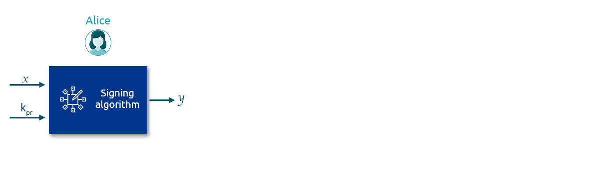

# Properties of Digital Signatures

It is critical to note a few additional properties that apply for digital signatures, apart from the two mentioned for conventional signatures at the beginning of the chapter:

### Integrity

As a digital signature is a function of the content $$sig \ k_{pr}(x)=y$$, If the content $$x$$ changes, so too will the digital signature $$y$$ and hence verification will return false. Therefore, if the message is tampered with or altered, it will be easily identifiable. On the other hand, the content can be changed or over-written while still keeping the signatures intact in the case with physical signatures. The below image shows this more clearly.

### Message Authentication

Since ideally, only Alice knows the private key, a digital signature provides compelling evidence that the sender of the message is Alice, and thus that the signature is authentic. It is an important property that enables the receiving party to verify the source of the message.

### Sender Non-Repudiation

As the private key is, in theory, known only to Alice, she cannot readily deny the creation of the message. This property is critical when the message sender, i.e., one signing the document, intends to cheat. Such disputes are resolved by the involvement of a neutral third party, i.e., court, where the possession of the private key provides critical evidence in favour of the honest party.
