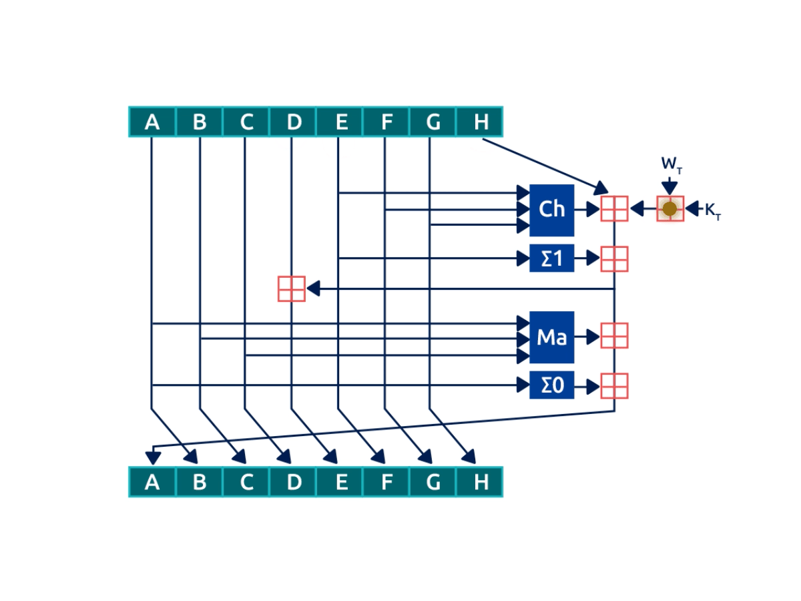

# The Hash Functions Found in BSV

## Merkle-Damgård Hash Functions

The fundamental issue with constructing a hash function is the fact that it must be able to take an input of arbitrary length and compress it into an output of a fixed length. If input is an arbitrary length, it's difficult to achieve second preimage resistance. Also, for a compression function to be collision resistant, it must take fixed length inputs that are longer than its output. One way to remedy this issue is to use a preprocessing step to pad the input to a fixed length rather than compress it directly. Once the input has been preprocessed, it can be compressed consistently.

In 1979, both Ralph Merkle and Ivan Damgård independently proved that so long as an appropriate padding scheme is used in the preprocessing step, and the compression function used is collision resistant (implying preiamge and second preimage resistance), it follows that the hash function itself is also collision resistant. The most popular hash functions in use today are based on this Merkle-Damgård method of construction.

Merkle-Damgård hash functions have three parts: input and preprocessing, compression, and final value construction and output. The preprocessing step pads the input message so its congruent to a fixed bitlength, e.g. 512 or 1024, and then appends the length of the input itself (this is called Merkle-Damgård strengthening). The compression step uses bitwise logical functions to compute and mutate the processed input in rounds using chaining variables to link each round. Finally, the chaining variables are concatenated and outputted most commonly in hexadecimal format.

## MD4 and MD5

The first two Merkle-Damgård hash functions to gain widespread adoption were Ron Rivest's MD4 and MD5. First specified in 1992 in the Internet Engineering Task Force (IETF) Request For Comments (RFCs) [1320](https://datatracker.ietf.org/doc/rfc1320/) and [1321](https://datatracker.ietf.org/doc/rfc1321/), respectively, MD4 and MD5 were the first hash functions to use a 448 congruent to 512 message block padding scheme with the remaining 64 bits left for Merkle-Damgård strengthening.

MD4 enjoyed short-lived success, but Rivest realized shortly after its release that it was likely to be insecure, so he designed MD5 shortly thereafter. Despite Hans Dobbertin's announcement of a collision found for MD5's compression function in 1996, MD5 enjoyed long-lived success. While cryptographers were recommending SHA-1 as a replacement to MD5 as early as 1996, MD5 continued to be used well into the early 2000s.

However, in 2004, Xiaoyun Wang, Dengguo Feng, Xuejia Lai, and Hongbo Yu developed an analytical collision attack that could reportedly be performed within an hour on an IBM p690 cluster. This marked the end for MD5 for use in key derviation and digital signatures. In 2008, CMU Software Engineering Institute announced MD5 was "cryptographically broken and unsuitable for further use".

Even so, the groundwork laid by MD4 and MD5 provided a practical framework for newer generations of hash functions to follow; including BSV's SHA-256 and RIPEMD-160 which both use 512 bit message blocks and 32 bit words.

## BSV's Hash Functions

As already mentioned, the two hash functions found in the BSV system are SHA-256 and RIPEMD-160. For reasons explored further in Chapter 7, Bitcoin uses SHA-256 and RIPEMD-160 in double hash forms: SHA-256(SHA-256) and RIPEMD-160(SHA-256) – often abstracted and referred to as HASH-256 and HASH-160, respectively, following the convention set out in the [original bitcoin code](https://github.com/trottier/original-bitcoin).

However, the following table displays the full range of hash functions commonly found in the greater BSV ecosystem; including SHA-512 and the HMACs of SHA-256 and SHA-512 which are often utilized by wallet implementations:\

| Hash Function         | Output Length | Description                                                                   | Example Application in BSV                               |
| --------------------- | ------------- | ----------------------------------------------------------------------------- | -------------------------------------------------------- |
| SHA-256               | 32 Bytes      | Generates unique 256-bit value from input string                              | 
1. Proof-of-work algorithm 2. Address Creation
 |
| RIPEMD-160            | 20 Bytes      | Generates unique 160-bit value from an input string                           | Address creation                                         |
| HASH-256              | 32 Bytes      | SHA256 hash of a SHA256 hash                                                  | 
1. Blocks 2. Transactions
                      |
| HASH-160              | 20 Bytes      | RIPEMD160 hash of a SHA256 hash                                               | Address creation                                         |
| SHA512                | 64 Bytes      | Generates unique 512-bit value from input string                              | Wallet encryption (AES)                                  |
| SHA256HMAC/SHA512HMAC | 32 Bytes      | HMAC Prevents length extension attacks and can be used with any hash function | Address Creation                                         |
