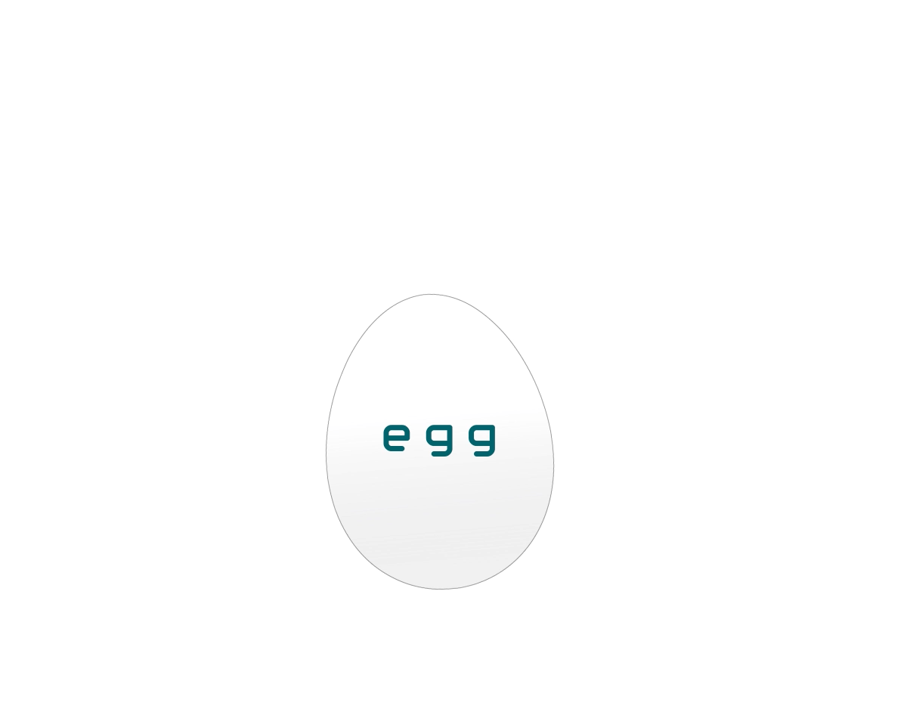
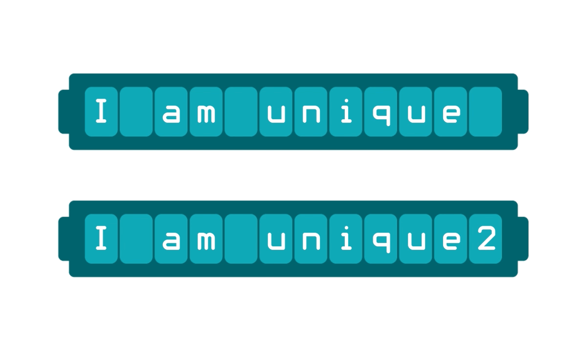

# The Three Important Properties of Hash Functions

## 1. Preimage Resistance: One-way

Hash functions are computationally infeasible to reverse -- in the same sense as trying to unscramble an egg or put toothpaste back into its tube. Said in another way, hash functions are one-way 'trap-door' functions; they make it easy to find a message digest from an input, but so difficult to find an input from a message digest, that it would either take longer than human beings are capable of waiting (sometimes longer than the age of the universe) or the cost of marshalling the necessary computing power to reverse them is so high, it's not worth doing it.

To be considered preimage resistant, it should take $$2^m$$ hash attempts (where m is the length of the output in bits) to find the corresponding input message for a particular message digest. If a preimage can be found using fewer than $$2^m$$ hash attempts, the hash function is no longer considered preimage resistant and is no longer secure.

## 2 .Second Preimage Resistance: Deterministic

The message digest of a hash function is consistent given the same input value. In other words, hash functions are deterministic -- the same input produces the same output hash every time. Furthermore, if even a single bit of the input message is changed, the resulting output hash is significantly different, unique, and preimage resistant.

## 3. Collision Resistance

It’s computationally infeasible to find two different input values that produce the same output value for a hash function. Although the fixed length of their output means a hash function has a collision risk, an ideal hash function produces message digests with a length large enough that the risk of finding a collision is so small, it’s safe to ignore in most situations.

Ideally, a hash function with an output value of bitlength $$m$$ should require at least $$2^{m/2}$$ operations to find a collision. In a **birthday attack**, given a set of m equally probable values, roughly $$2^{m/2}$$ random samples are needed to find a single collision. This means if a collision is found in fewer than $$2^{m/2}$$ random samples, the collision resistance property of the hash function is “broken”, and it’s no longer considered secure.

This is particularly important with respect to BSV's proof-of-work process.
