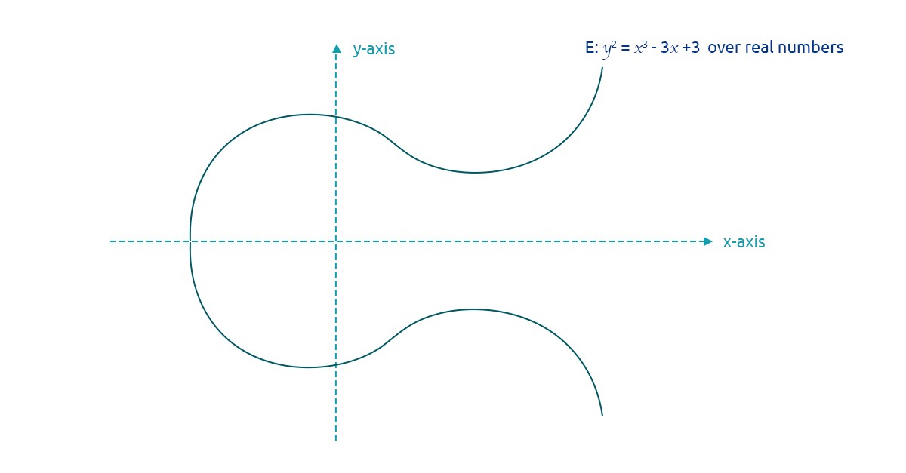

# BSV Addresses & WIFs



## Satoshis Are Property

When a transaction is added to the ledger, it acts as a timestamped record of a change of ownership with satoshis (and whatever else is included in the transaction) being the property exchanged. Unlike account-based systems like a bank account where money is added and subtracted to and from the account with each transaction, satoshis aren’t actually ‘sent’ and ‘received' in UTXOs. In much the same way the ownership of gold is transferred without physically moving the gold, the ownership change of satoshis is tagged in UTXOs, and the event itself recorded in transactions. However, it’s important to note that BSV is not digital gold.

Since the BSV ledger is public, the ownership history of all 2,100,000,000,000,000 satoshis can be traced back to their issuance in 2009 by following the chain of digital signatures that link each UTXO and transaction in their history. This means Bitcoin doesn’t have accounts, so identity can be pseudonymously tied to each UTXO allowing macro-level activity to be visible while simultaneously providing individual privacy. It also means there’s a lot more flexibility in how transactions are conducted than account-based systems because a transaction doesn’t need to be submitted by an account holder; it can be submitted by anyone. However, identity is still a fundamental part of communication and UTXOs are still traceable and identity is still attributable when required.

All electronic communications are based on two concepts: using some kind of shared secret or signal so parties know they're talking to the correct people, and attributing identity to documents or messages so parties can attest to their ownership. The two most common methods used to make these two concepts a reality are the Diffie-Hellman key exchange algorithm and digital signatures.

## Diffie-Hellman Key Exchange and the Discrete Logarithm Problem (DLP)

Much of the modern world is based on the concept of using a secure secret as a 'seed' value to encrypt communications: symmetric end-to-end (E2E) encryption. There are two problems with this approach:

1. If everything is encrypted, how can attackers be stopped if they gain access to a system -- since system administrators can't tell good network traffic from bad because everything is encrypted.
2. How do the communicating parties share the secret seed securely.

We explore how BSV addresses the first problem without using encryption in Chapter 7, but the answer to the second problem was found before the internet began, called the Diffie-Hellman key exchange, and it's based on the idea of using asymmetric, public-private, key-pairs to generate a symmetric shared secret, securely.

Published in 1976 by Ralph Merkle, and named after Whitfield Diffie and Martin Hellman, the Diffie-Hellman key exchange method is the earliest publicly known protocol for exchanging asymmetric keypairs. To this day, Diffie-Hellman is used extensively in everything involving end-to-end encryption, and even in the exchange of physical keys via written notes in some instances.

Essentially, the Diffie-Hellman key exchange algorithm works by taking advantage of the unique mathematical properties of the modulo operation, or in other words, the logarithm space of a given power ‘$$n$$'. The modulo operation '%' yields the remainder after division: e.g. $$4 \ mod \ 3 = 1$$. However, another way of looking at modulo is that it limits results to a certain space. For example, mod $$2^{32}$$ or mod $$2^{64}$$ are commonly used in computer science to constrain results to 32- or 64-bit integers because those are the largest integers computers can currently handle natively: uint32 and uint64. This means any number, or key, mod n will remain within the space of 0 to n.

First, two communicating parties agree on two numbers: a generator point ‘$$g$$', and a certain ‘order’ or modulo space '$$n$$’ which must be a large prime number. Next, each party picks a random number (the larger, the better) which act as their private keys: $$a$$ and $$b$$. They then use their private keys and the generator point $$g$$ to calculate their public keys: $$A = g^a \ mod \ n$$ and $$B = g^b \ mod \ n$$. Following that, they exchange their public keys in clear text over a public medium, and they can do so securely because so long as $$n$$ is sufficiently large, it's computationally infeasible to find $$a$$ or $$b$$ from $$A$$ or $$B$$ even when $$g$$ is known -- this is called the Discrete Logarithm Problem (DLP). Once the two parties have exchanged their public keys, all they need to do is exponentiate the other party's public key by their private key, and both parties end up with the same shared secret value '$$sv$$': $$sv = A^b \ mod \ n = B^a \ mod \ n$$.

For example, say Alice generates a private key ‘$$a$$' (currently these kinds of keys are 2,000 to 4,000 bits long for security), and Bob generates a private key '$$b$$’. Knowing $$g$$ and $$n$$, Alice can calculate her public key as $$g^a \ mod \ n$$, and Bob his public key as $$g^b \ mod \ n$$, and, given a sufficiently large $$n$$ (again 2,000 to 4,000 bits) it's impossible for anyone to figure out what $$a$$ or $$b$$ are without brute-force checking all the possibilities $$g^1 \ mod \ n,\ g^2 \ mod \ n, etc$$.

From there, Alice and Bob can exchange their public keys knowing it won’t expose their private keys, and then they can use the properties of exponentiation to derive the same secret value:\
$$sv = (g^a)^b mod \ n = (g^b)^a mod \ n$$

## Digital Signature Algorithm

There's one big problem with the Diffie-Hellman key exchange algorithm: a nefarious actor could intercept the public keys during the exchange, posing as either Alice or Bob, and pass their own public key back. This is called a "man-in-the-middle" attack. Digital signatures are a solution to man-in-the-middle attacks.

A digital signature is a lot like a physical signature; it acts as to associate an individual identity to a document. The advantage digital signatures have over physical signatures is they're much easier to verify. Using a digital signature with at least one of the public key exchange messages in Diffie-Hellman can ensure the key is coming from who it's supposed to be coming from. The most popular digital signature algorithm -- used as the US government standard -- is the aptly named DSA.

Similar to the Diffie-Hellman known parameters '$$g$$' and '$$n$$', DSA uses 3 parameters: '$$p$$', '$$q$$', and '$$g$$'. $$p$$ and $$q$$ are randomly generated big prime numbers, where $$p-1$$ is a multiple of $$q$$. Like Diffie-Hellman, $$g$$ is the generator point. First Alice and Bob generate a public-private key-pair $$a, A$$ and $$b, B$$, respectively. Similar to Diffie-Hellman, these private keys are randomly generated numbers less than $$p$$, and their corresponding public keys are generator point to the power of the respective private key modulus $$p$$.

The two processes of signing a message '$$m$$', and verifying the signature, then become:

* Computing the signature:
  1. Generate a random number '$$k$$'
  2. $$r = (g^k \ mod \ p) \ mod \ q$$
  3. $$s = (k^{-1} m + ar) \ mod \ q$$\

* Verifying the signature:
  1. $$z = s^{-1} \ mod \ q$$
  2. $$w_1 = m * z \ mod \ q$$
  3. $$w_2 = r * z \ mod \ q$$
  4. $$v= (g^{w_1}A^{w_2} \ mod \ p) \ mod \ q$$
  5. $$v == r$$



## Elliptic Curve Diffie-Hellman (ECDH) and the Elliptic Curve Digital Signature Algorithm (ECDSA)

ECDH and ECDSA use pretty much the same process as standard Diffie-Hellman and DSA; again, the major difference being multiplication is used instead of exponentiation. For example, say Alice and Bob have decided to upgrade their system from standard Diffie-Hellman and DSA using a 3,072 bit key-size to ECDH and ECDSA, and they want to maintain the same level of security they currently enjoy:

* Standard Diffie-Hellman:
  * $$sv = (g^a)^b \ mod \ 2^{3072} = (g^b)^a \ mod\ 2^{3072}$$\

* ECDHA:
  * $$sv = g * b * a \ mod \ 2^{256} = g * a * b \ mod \ 2^{256}$$\

* Standard DSA signature computation for a hash of a message '$$m$$' using private-public key-pair $$a, A$$:
  1. $$a$$ = random integer between 0 and 23072
  2. $$A = g * a$$
  3. Generate a random, 1-time use, key '$$k$$'
  4. $$r = (g^k \ mod \ p) \ mod \ q$$
  5. $$s = (k^{-1} m + ar) \ mod \ q$$\

* ECDSA signature computation for a hash of a message '$$m$$' using private-public key-pair $$a, A$$:
  1. $$a$$ = random integer between 0 and $$2^{256}$$
  2. $$A = g*a$$
  3. Generate a random, 1-time use, key '$$k$$'
  4. $$R = k * g$$
  5. $$r = R_x \ mod \ q$$
  6. $$s = (m + a * r)k^{-1} \ mod \ q$$\

* Standard DSA signature verification:
  1. $$z = s^{-1} \ mod \ q$$
  2. $$w_1 = m * z \ mod \ q$$
  3. $$w_2 = r * z \ mod \ q$$
  4. $$v = (g^{w_1}A^{w_2} \ mod \ p) \ mod \ q$$\

* ECDSA signature verification:
  1. $$z = s^{-1} \ mod \ q$$
  2. $$w_1 = m * z \ mod \ q$$
  3. $$w_2 = r * z \ mod \ q$$
  4. $$v = (g * w_1) + (A * w_2)$$
  5. $$v_x == r \ mod \ q$$

Although BSV's UTXO model takes a different approach than full end-to-end encryption of all communications, it's still fundamentally based on the two ideas of a shared secret and digital signatures.


## What is a BSV Address?

A BSV address is the RIPEMD-160 hash of the SHA-256 hash of the compressed x-coordinate of the public key of a public-private ECDSA key-pair prepended with a version byte and encoded in Base58Check… which sounds a lot more complicated than it actually is.

In P2PKH transactions, BSV addresses are the message digests or the “Public-Key-Hash" the satoshis are “Paid-to”.

## What is a WIF?

A WIF (Wallet Import Format) key is similar to a Bitcoin address since they both use the Base58Check encoding; however, instead of using the compressed x-coordinate of the public key, the serialised ‘d' value of a private key is used, and WIFs don't use the HASH-160 of the key value.

## Generating a Bitcoin ECDSA Public-Private Keypair in GoLang

To generate a Bitcoin public-private ECDSA keypair in golang using the [libsv libraries](https://github.com/libsv):

```markup
package main 

import ( 
      "fmt" 
      "github.com/libsv/go-bk/bec" 
      "github.com/libsv/go-bt/v2/bscript" 
) 

func main() { 

      privKey, _ := bec.NewPrivateKey(bec.S256()) 

      pubKey := privKey.PubKey() 

} 
```

## How to Create a BSV Address in Golang

Once a public-private ECDSA keypair has been generated, deriving a BSV address from the public key is easy:

```markup
package main 

import ( 
      "fmt" 
      "github.com/libsv/go-bk/bec" 
      "github.com/libsv/go-bk/crypto" 
      "github.com/libsv/go-bt/v2/bscript" 
)   

func main() { 

      privKey, _ := bec.NewPrivateKey(bec.S256()) 

      pubKey := privKey.PubKey().SerialiseUncompressed() 

      pubKey = crypto.Sha256(pubKey) 

      pubKey = crypto.Ripemd160(pubKey)   

      version := make([]byte, 0)       

      version = append(verison, 0x00) // 0x4d for testnet   

      pubKey = append(version, pubKey...)  

      address := bscript.Base58EncodeMissingChecksum(pubKey)   

      fmt.Printf("Address: %s\n", address) 
  
} 
```

1\. Get the compressed x-coordinate of the public key:

```markup
pKey := pubKey.SerialiseCompressed() 
```

2\. Hash the compressed x-coordinate of the public key with SHA-256:

```markup
pKey := crypto.Sha256(pKeyV) 
```

3\. Hash the result of step 2 with RIPEMD-160:

```markup
pubKey = crypto.Ripemd160(pubKey) 
```

4\. Create a new byte array and prepend with either 1 or ‘M' or 'N’ for mainnet or testnet, respectively:

```markup
version := make([]byte, 0) 

version = append(version, 0x00) // 0x4d for testnet 
```

5\. Append the result of step 3 to the result of step 4:

```markup
pubKey = append(version, pubKey...) 
```

6\. Generate and append a checksum to the result of step 5, and then encode the byte array in Base58:

```markup
address := bscript.Base58EncodeMissingChecksum(pubKey) 
```

7\. Print result to standard out:

```markup
fmt.Printf("Address: %s\n", address) 
```

Activity – Generate a Bitcoin Address from a compressed public key

Using the [hash calculator](https://bitcoinsv.academy/hash-calculator), generate a Bitcoin address for the following compressed public key:

```markup
03baead150be4db1c985d1eac82e5370daad723bba35c859463970a0a1b5d39002
```

## How to Create a Bitcoin WIF in GoLang:

```markup
package main 

import ( 
      "fmt" 
      "github.com/libsv/go-bk/base58" 
      "github.com/libsv/go-bk/bec" 
      "github.com/libsv/go-bk/crypto" 
)   

func main() { 

      privKey, _ := bec.NewPrivateKey(bec.S256()) 
  
      pKey := privKey.Serialise() 
  
      version := make([]byte, 0) //0xef for testnet 
  
      version = append(version, 0x80)   

      pKey = append(version, pKey...) 
  
      pKey = append(pKey, 0x01) 
 
      chksum := crypto.Sha256d(pKey)[:4] 
     
      pKey = append(pKey, chksum...) 
 
      w := base58.Encode(pKey)   

      fmt.Printf("WIF: %s\n", w)   

} 
```

1\. Get the serialised private key 'd':

```markup
pKey := privKey.Serialise() 
```

2\. Create an empty byte array, and append with either 1, or 5, depending on whether or not the WIF is for mainnet or testnet, respectively:

```markup
version := make([]byte, 0x80) //0xef for testnet 

version = append(version, 0x80) 
```

3\. Append the serialised private key bytes to the byte array from step 2:

```markup
pKey = append(version, pKey...) 
```

4\. Append the compression byte at the end to denote a corresponding compressed public key will be used:

```markup
pKey = append(pKey, 0x01) 
```

5\. HASH-256 the byte array from step 4 and save the first 4 bytes:

```markup
chksum := crypto.Sha256d(pKey)[:4] 
```

6\. Append the 4 checksum bytes from step 5 to the result from step 4:

```markup
pKey = append(pKey, chksum...) 
```

7\. Encode the result of step 6 in Base58 (since the ‘Check' was added in step 6):

```markup
w := base58.Encode(pKey) 
```

8\. Print result to standard out:

```markup
fmt.Printf("WIF: %s\n", wif) 
```

#### Activity – Generate a BSV WIF from a serialised private key

Using the [hash calculator](https://bitcoinsv.academy/hash-calculator), generate a BSV WIF for the following private key 'd' value:

```markup
02e4f3975f6985c3cc20167fa0b38e649a67a66149844acc68b14eb361f510c2
```
