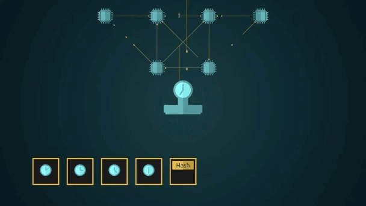

# The Hash Puzzle

The final 4 bytes of the block header is the ‘number used once’ (nonce) which is used in proof of work. When proof of work is done, the nonce value is changed, and the block header is put through the HASH256 function. A valid block header hashes to a value which is lower than the target value specified in the nBits field in the header. If the output is above the difficulty target, the nonce is incremented and the hashing process is repeated.

If a valid block header is discovered the miner can submit their block to the network for validation by their peers. Successful validation and acceptance of the block commits the batch of transactions whose Merkle root is in the block header to the public ledger. The nature of this outcome leads to valid block headers hashing to a value with numerous leading zeroes.

The bitcoin difficulty target as specified by nBits is calculated by taking the elapsed time in seconds between a specific number of blocks that have been produced and seeing how far above or below that number is in seconds relative to an ideal elapsed time in seconds that averages one block being created every ten minutes. The difference between the elapsed time is divided by the ideal time to yield the value for the coefficient in the bitcoin difficulty adjustment algorithm.

This algorithm places the difficulty target value somewhere between the maximum and minimum values that can be generated as an output from the SHA256 function. An elapsed time that reveals the hash puzzle was taking longer than 10 minutes to find a solution for means that the difficulty target will increase, thus increasing the number space for available solutions below that target. Conversely, an elapsed time that indicated blocks were being produced quicker than a ten-minute average means the target will be lowered, thus decreasing the number space for a valid solution or making the challenge more difficult. The lowest possible outcome of the SHA256 hash function is 0, and the largest $$7.8 * 10^{76}$$ (or 64 F’s in hex). The difficulty target is a value somewhere within this range, for example $$3.5 * 10^{55}$$. This has the effect of creating a probability for a valid solution as 1:$$10^{20}$$ or 0.00000000000000000001%.

The network tunes itself such that the cumulative computing power being applied to the hash function generates a valid block approximately every 10 minutes. Just as a new coin toss following 100 heads still has a 50:50 chance of landing on heads, any string being put through a hash function will always have the same probability of its output being less than a target value.

As the bitcoin system scales and transactions move into the tens of thousands per second, this means that tens of thousands of times per second, a new Merkle root is calculated by each node. The Merkle root is incorporated into a mining candidate which is relayed to the hashing machines periodically. These then perform the process hashing and testing iterations of the header until they generate an outcome that satisfies the difficulty target.

This colossal task is known as Proof of Work in the bitcoin system, and it is by engaging in this intensive process in order to produce blocks that qualifies systems connected to the network as nodes within bitcoin small world network. The collective hash power designated to this Proof of Work process is measured in a unit of hashes per second. A hash rate of 1 Exahash means 1 000 000 000 000 000 hashes are executed by the network per second, across a variety of block header candidates. The system will continue to adjust the difficulty target to maintain average 10-minute block discovery rate.

Originally, bitcoin was released with an algorithm that adjusted its difficulty every 2016 blocks; however, the difficulty adjustment algorithm was changed to calculate a new target after every block. This original algorithm will be restored as part of a future node client system update.
