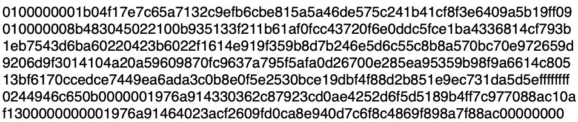
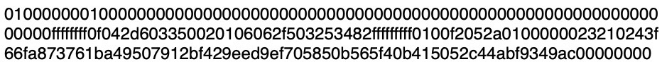
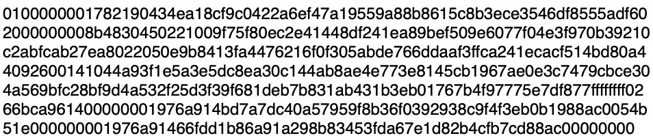
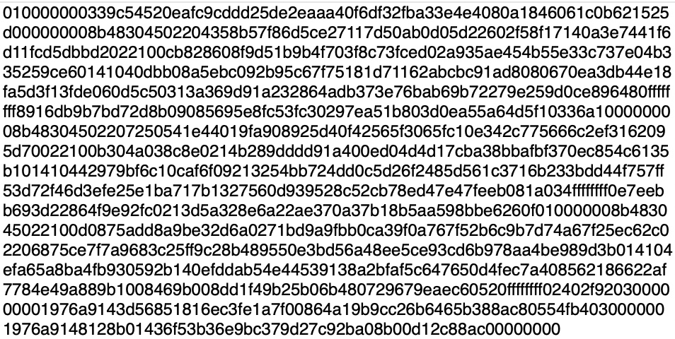

# Chapter 4 - Assessment

**Question 1**

&#x20;

Which of the following raw transaction data is for a coinbase transaction?

*
[ ] 
    <figure><figcaption></figcaption></figure>
*
[x] 
    <figure><figcaption></figcaption></figure>

*
[ ] 
    <figure><figcaption></figcaption></figure>

*
[ ] 
    <figure><figcaption></figcaption></figure>

&#x20;

**Question 2**

Given the nBits value: 1a07a85e\
What is the value of the index in decimal?

* [ ] 16&#x20;
* [ ] 17&#x20;
* [x] 26&#x20;
* [ ] 27

**Question 3**

Given the nBits value: 1a07a85e\
What is the value for the coefficient in decimal?

* [ ] 1588070170&#x20;
* [ ] 6203399&#x20;
* [ ] 436709470&#x20;
* [x] 501854

**Question 4**

Given the nBits value of 1a07a85e and the difficulty target value equation:

Target = coefficient x 2( 8 \* (index — 3) )

What is the difficulty target in decimal?

* [ ] 5.2 x 10^33&#x20;
* [ ] 2.6 x 10^39&#x20;
* [ ] 1.2 x 10^61&#x20;
* [ ] 1.1 x 10^55

**Question 5**

Given block hash 00000000000006d03690e597a3d60ce9920e410f0ff3a6d1917998f90dea8a45, an nBits value of 1a07a85e and the difficulty target value equation:

Target = coefficient x 2( 8 \* (index — 3) )

Does the block header satisfy the requirements to be a valid solution to the hash puzzle?

a. Yes

b. No

**Question 6**

Node A has 2% of the network hash power, Node B has 49% of the network hash power and node C has 49% of the network hash power. \
Node A shares its transaction list, index and Merkle tree data with Node B who also shares the same data with Node A.\
Nodes A and B do not share any data with Node C nor does C share any real time data with them.\
Node C produces and proposes a block X at time (t). Node A produces and proposes a block Y at (t+5s).\
It takes 1 second for node B to validate A's block proposal and 10 seconds to validate node C's proposed block.\
Which node's block will most likely be the one to extend the chain with the majority of hash power working on that chain tip?&#x20;

a. Node A

b. Node B

c. Node C

d. It will be an orphan race.

**Question 7**

A block has 4.3 billion transactions in it. How many values will be in the Merkle path from leaf node to Merkle root?

\
a. 32

b. 64

c. 256

d. 2048

**Question 8**

A block has 4.3 billion transactions in it which average 1KB in size. What will be the approximate path size for a Merkle proof?

a. 1024B

b. 1024KB

c. 1024MB

e. 1024GB
