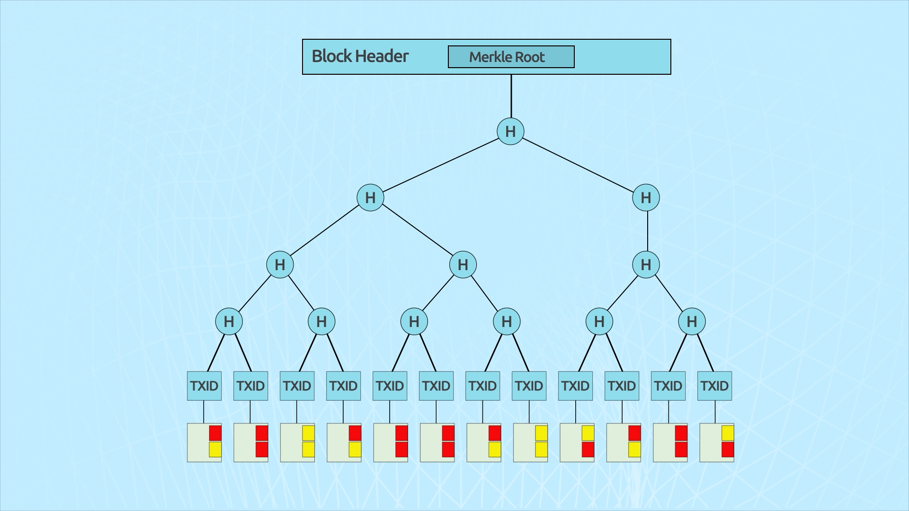

# Saving Disk Space

> "A user only needs to keep a copy of the block headers of the longest proof-of-work chain, which he can get by querying network nodes, until he's convinced he has the longest chain, and obtain the Merkle branch linking the transaction to the block it's time stamped in."
>
> \- Satoshi Nakamoto, Bitcoin Whitepaper

Over the years there has been a lot of confusion about the consequences of growing the ledger to a size of giga- or terabytes. Detractors argued it makes it burdensome for casual users to download and sync their copy of the ledger for generating and receiving transactions. Due to the fact the creator outwardly took their leave from the bitcoin ecosystem, it was left for individuals to interpret how Bitcoin was designed to work and as such many developers configured node and wallet software in ways that didn’t make full use of the efficiency of the Merkle trees in Bitcoin as a data verification process. Bitcoin was always intended to handle an extremely large volume of transactions in unbounded blocks, validated by enterprise grade hardware at highly networked locations.

As a transaction is generated on the BSV network, the solution to a locking script for unspent transaction outputs (UTXOs) from either a coinbase or earlier transaction is consumed as an input, and the locking scripts for the balance to be transferred are generated and passed on to the new recipients as fresh UTXOs. In addition to this, locking scripts are generated for any change from the inputs and returned to the person who made the payment as fresh UTXOs as well. The difference between the inputs and outputs being collected as fees by the node who produces the block the transactions are recorded in.

\\

.jpg)

Once all the UTXOs generated by a transaction have been consumed in new transactions there is no necessity for a node to store any of the transaction details. In this way a node can prune the database to only contain UTXOs that are yet to be consumed and through the use of the chained block headers and Merkle trees, all tokens on the network can be accounted for in the past and present. We call a Merkle tree which has had transactions removed (or added) a 'Working Blockchain', or a set of transactions which is limited to only those relevant to the prescribed activity taking place, but which are also tied back to the proof of work of each block in the chain. While individuals and archival nodes may maintain a full transaction history, they will do so either voluntarily, or because it is economically viable for them to do so as a paid service. Through the use of hash functions and Merkle tees, transactions can always be verified by checking a Merkle proof. This greatly enhances the efficiency and quality of accounting and compliance processes such as an audit.

Despite the prominent narratives within the community of other digital assets, for a casual user, there is no imperative for them to maintain a full version of the ledger or the UTXO set. Since a wallet is a key management software that maintains the keys which can provide solutions to the locking scripts of the various UTXOs held within the wallet, a wallet need only to store the block headers, TXID, TX indexes and Merkle proofs for any UTXO they hold. As a block header is only 80 bytes and there are 144 blocks found a day on average, a wallet client needs only 4.2MB of storage a year to maintain the new block headers generated on the network. From there they can then query the miners, or request in a transaction, the node values along the Merkle paths for any UTXOs they possess, which can then be used for verification against the target Merkle root in the relevant header.

| **Number of Transactions** | **Approx. Size of Block** | **Path Size (Hashes)** | **Path Size (Bytes)** |
| -------------------------- | ------------------------- | ---------------------- | --------------------- |
| 16 transactions            | 4 kilobytes               | 4 hashes               | 128 bytes             |
| 512 transactions           | 128 kilobytes             | 9 hashes               | 288 bytes             |
| 2,048 transactions         | 512 kilobytes             | 11 hashes              | 352 bytes             |
| 65,535 transactions        | 16 megabytes              | 16 hashes              | 512 bytes             |

Even in a dataset that had a Merkle tree of a thousand layers, the fact you only need a 32-byte value from each level to perform a verification proof means the sum of the node values for the Merkle paths of UTXOs that came from enormous blocks (2^1000 transactions) would still only be around 32KB to recalculate the target Merkle root for transaction verification.

As we saw in chapter 1, as the Merkle tree grows to include new transaction leaf nodes, there are substructures within the tree that are preserved as the right-hand branch grows and the new root value is calculated. This also means that these data structures are very well suited to parallel processing by the nodes to increase their competitive advantage in validating transaction sets, which again further illustrates their essential efficiency in allowing BSV to scale to a global payment network.\
\
Were BSV designed to store transactions in other data structures such as linked lists, then there would be substantially greater computational overhead that would have to be performed by nodes to validate transactions recorded in a block, and the simplified payment mechanism would be unable to work due to there being no efficient process to relay a condensed envelope of node values which could allow verification of an entry within the data set.
