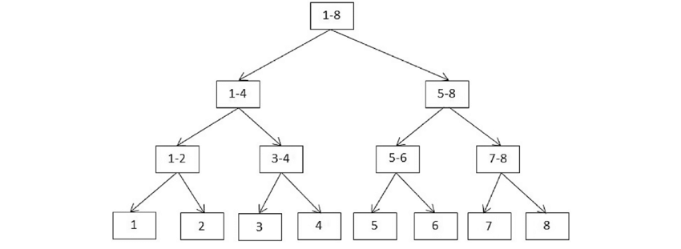

# Chapter 1 - Assessment

**Question 1**

&#x20;

Using the [hash tool](https://bitcoinsv.academy/hash-calculator), put the following strings through the SHA256 hash function to generate the leaf nodes for a n=8 Merkle tree and submit your answers for checking.

&#x20;

| **String**                                                                                                   | **Hash Output**                                                  |
| ------------------------------------------------------------------------------------------------------------ | ---------------------------------------------------------------- |
| Merkle                                                                                                       | 728beae3756e9ea17b15ecbc095a5c0d7bba2c3182b83606baf199560ba868ba |
| merkle                                                                                                       | 7975edd9e7393c229e744913fe0d0bb86fb4cf46906e2e51152137e20ad15590 |
| Merkle.                                                                                                      | deec3768d35c91629a6009615c81325ce64326b64cc6cf4bc030ac81735f44a6 |
| Angela Merkle                                                                                                | 1bbf3a5e3dcd411436ac3f316f943d6c8bb73d0fe2e61eb0bfb05fafc7b27c68 |
| The Merkle tree is data structure that allows for the efficient verification of an object within a data set. | dd9b934231c0de7bb17ae690de982d415a14805e922278001fd942ed1864ba9a |
| Merkle trees are better than normal trees.                                                                   | 7437606ded93a98d18ba92655e7b4d80341e67f4d2ed8668c0e03580f5902f29 |
| I want Merkle trees in my garden.                                                                            | 08799c76ea4b1fe1e29549efb6546d925a2f455eec0c34135e8a213b96f3240f |
| Ralph and Angela sitting in a Merkle tree, H, A, S, H, I, N, G.                                              | 104f2c8ee72d8e45fc57c625f7eba77f060b14ff74f1cf52e8945ebef3dab3c7 |

&#x20;

**Question 2**

<figure><figcaption></figcaption></figure>

&#x20;

| **String** | **Hash Output**                                                  |
| ---------- | ---------------------------------------------------------------- |
| 1          | 728beae3756e9ea17b15ecbc095a5c0d7bba2c3182b83606baf199560ba868ba |
| 2          | 7975edd9e7393c229e744913fe0d0bb86fb4cf46906e2e51152137e20ad15590 |
| 3          | deec3768d35c91629a6009615c81325ce64326b64cc6cf4bc030ac81735f44a6 |
| 4          | 1bbf3a5e3dcd411436ac3f316f943d6c8bb73d0fe2e61eb0bfb05fafc7b27c68 |
| 5          | dd9b934231c0de7bb17ae690de982d415a14805e922278001fd942ed1864ba9a |
| 6          | 7437606ded93a98d18ba92655e7b4d80341e67f4d2ed8668c0e03580f5902f29 |
| 7          | 08799c76ea4b1fe1e29549efb6546d925a2f455eec0c34135e8a213b96f3240f |
| 8          | 104f2c8ee72d8e45fc57c625f7eba77f060b14ff74f1cf52e8945ebef3dab3c7 |

&#x20;

Using the above 8 leaf node values from Question 1, calculate the interior node values for each layer and the Merkle root for the n=8 data set.

&#x20;

| Node | Hash Value                                                       | Node               | Hash Value                                                                      | Node                               | Merkle Root                                                                                     |
| ---- | ---------------------------------------------------------------- | ------------------ | ------------------------------------------------------------------------------- | ---------------------------------- | ----------------------------------------------------------------------------------------------- |
| 1-2  | cd550962d71468c3fd506659550e85556cdb1bc5732147c8d0a83e0039073157 | 
1:4

 
 | 
5c4e816ff3f423c944bb731ff9c5d8d6c94ad2382fdd20d683f7f53cdaaa2a96

 
 | 
1:8

 

 

 
 | 
cb616ffdb9c4b9d8a5779d313feb1d4e72057a18aa8afbbba4cbd0668c6c3143

 

 

 
 |
| 3-4  | fd1dda0adc00ac809aa919ffa6c51945298f361236fcb8bf6ab603994070a3f0 |                    |                                                                                 |                                    |                                                                                                 |
| 5-6  | 4986379cc1f295d076d5c1f9024684a38a312af31375d8ddec806c320fb61a45 | 
5:8

 
 | 
ac23d6710fe773c9a65343383f2c43bda4d731fe373572c31a89692b631b72ba

 
 |                                    |                                                                                                 |
| 7-8  | b62bd0509ad0fcb0f3a2e3187ad9ba377671aae923ff05af5454bd4924af926c |                    |                                                                                 |                                    |                                                                                                 |

&#x20;

**Question 3**

&#x20;

Now using the Merkle root calculated in the previous question: _cb616ffdb9c4b9d8a5779d313feb1d4e72057a18aa8afbbba4cbd0668c6c3143_, calculate the value of the leaf node for a ninth data element that has been added to the set, then using that value calculate the interior node values for each layer and the new Merkle root.

&#x20;

<table data-header-hidden><thead><tr><th width="215"></th><th width="334"></th></tr></thead><tbody><tr><td><strong>Merkle Root for the 9-element data set</strong></td><td></td></tr><tr><td>String</td><td>Merkle merkle Merkle. Merk!</td></tr><tr><td>Layer 0</td><td>5bff83fe50c8f36e3a7829510ad1cac2d1e31ae2585c00d7db46bd696e15d528</td></tr><tr><td>Layer 1</td><td>55066a8b1980529201c99f64e8e69e7a24a78ccb3d73e1ab37f8a255840cd998</td></tr><tr><td>Layer 2</td><td>3520f3f3051db6c548cdb16be0477f6121f13b5d1c4af45a580af77b62b47133</td></tr><tr><td>Layer 3</td><td>eeeea7acddb8616e046da57d3b11999aa41f092d3542d7b48b8ca9c48d6e3012</td></tr><tr><td>Merkle Root</td><td>4a126667a1f5adb902803bb3c6e073902d39e012f05f922ba9d0a45c0e628061</td></tr></tbody></table>

&#x20;
