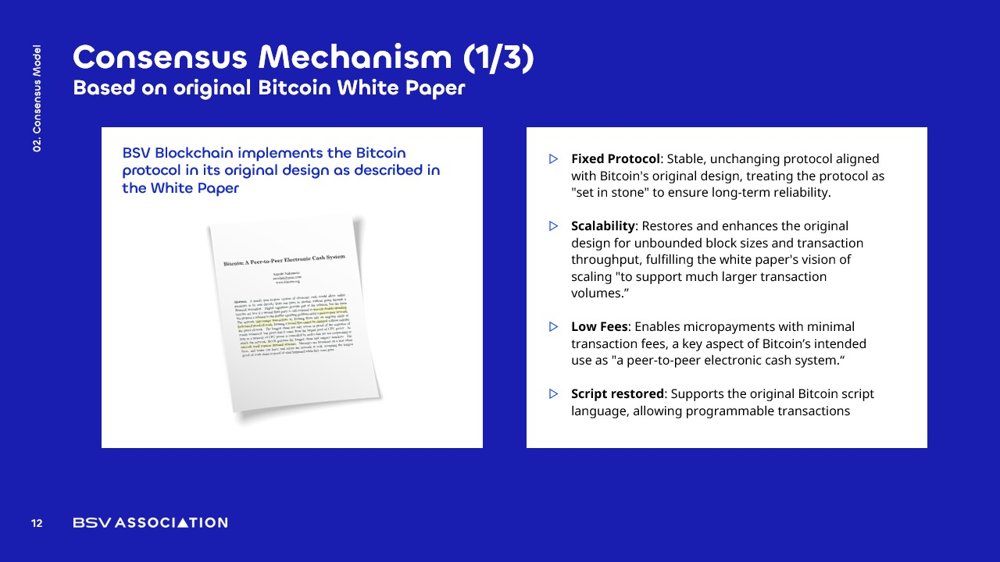

# Core Features of BSV Blockchain

<figure><figcaption></figcaption></figure>

### Fixed Protocol

The BSV blockchain adheres to a **fixed protocol** that remains stable and unchanging. This characteristic is crucial for several reasons:

* **Long-term Reliability**: By treating the protocol as "set in stone," BSV provides a **dependable foundation** for businesses and developers.
* **Confidence in Development**: Stakeholders can build applications and services without fear of **sudden changes** or fragmentation in the protocol.
* **Alignment with Original Design**: The protocol reflects the **original vision** outlined in Bitcoin's white paper, ensuring consistency with its foundational principles.

### Scalability

BSV enhances Bitcoin's **scalability** by restoring its intended capacity for **unbounded block sizes** and transaction throughput. Key points include:

* **Support for High Transaction Volumes**: BSV can handle **millions of transactions per second**, fulfilling the original vision of Bitcoin as a scalable payment system.
* **Peer-to-Peer Cash Usage**: Unlike BTC, which is limited to approximately **seven transactions per second**, BSV enables true **peer-to-peer cash transactions** on a global scale.
* **Future-Proofing**: The architecture is designed to accommodate **growing transaction demands** without compromising performance.

### Low Fees

BSV's **low transaction fees** make it an ideal platform for **micropayments**, unlocking new business models. Notable aspects include:

* **Micropayment Viability**: Users can pay **fractions of a cent** for digital content, data access, or services, promoting a **pay-per-use model**.
* **Decoupling from Subscriptions**: Individuals can engage in transactions without being tied to **traditional subscription models**.
* **Alignment with Bitcoin's Vision**: This feature realizes the white paper's goal of Bitcoin as **"a peer-to-peer electronic cash system."**
