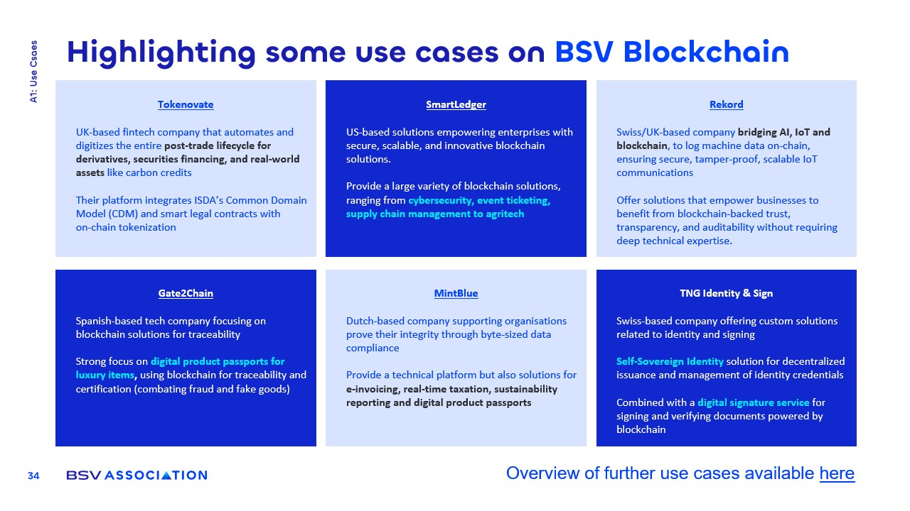

# Blockchain Applications in Industry

<figure><figcaption></figcaption></figure>

### Agriculture and IoT Integration (Rekord)

Rekord integrates **AI, IoT, and blockchain** to transform supply chain.

* A notable project includes a **multi-million dollar contract** with a chicken farm, monitoring millions of chickens through advanced technology.
* **AI and sensors** track critical parameters such as **temperature, humidity, and animal behavior**, ensuring optimal conditions for livestock.
* All AI decisions and sensor readings are **logged on-chain**, providing a **transparent and auditable record** that enhances trust in operations.
* Outcomes include a **25% reduction in insurance premiums**, demonstrating the financial benefits of **verified, trusted AI-driven agricultural practices**.

### Digital Identity Solutions (TNG Identity & Sign)

TNG Identity & Sign provides innovative **digital identity** and **signature services**, leveraging **blockchain technology**.

* They collaborate with **KYC providers** to deliver robust blockchain-based identity solutions that enhance **security**and **compliance**.
* Already utilized by various enterprises, TNG is **scaling its services globally**, indicating strong **market demand**.
* This reinforces the role of blockchain as a **trust layer** for **identity verification**, **compliance**, and **secure transactions**, addressing critical challenges in **digital identity management**.
