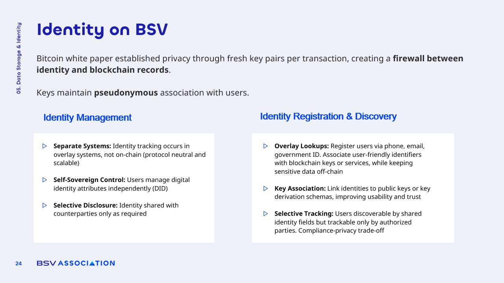

# Identity on the BSV Blockchain

<figure><figcaption></figcaption></figure>

### Importance of Identity

**Identity** is a fundamental aspect of the digital landscape, particularly in the context of **blockchain technology**. It serves as a cornerstone for **trust and security** in online interactions.

* **Empowerment**: Individuals, businesses, and devices gain control over their own data.
* **Selective Sharing**: Users can choose what information to disclose and to whom, enhancing **privacy**.
* **Decentralization**: Reduces reliance on centralized platforms, mitigating risks associated with **data breaches**.

### Self-Sovereign Identity

**Self-sovereign identity (SSI)** allows users to own and manage their digital identities independently of centralized authorities.

* **Ownership**: Users retain full control over their personal information.
* **Contextual Disclosure**: Information can be shared selectively based on the situation, such as proving age without revealing full identity.
* **Privacy**: Enhances user privacy by minimizing unnecessary data sharing.

### Device Identity

**Device identity** is crucial for the **Internet of Things (IoT)**, enabling devices to authenticate and verify their data.

* **Unique Identities**: IoT devices, like weather sensors, are assigned distinct identities to ensure **data integrity**.
* **Use in Insurance**: Data from devices can be logged on-chain to substantiate claims, such as storm damage in vineyards.
* **Authenticity Verification**: Ensures that the data provided by devices is genuine and trustworthy.

### Digital Notary and Selective Disclosure

**Blockchain technology** can replace traditional notary services, providing a **digital notary function**.

* **Timestamping**: Acts as a **timestamp server**, ensuring the immutability of records.
* **KYC Verification**: Know Your Customer processes can be anchored **on-chain**, allowing for reuse without repeated verification.
* **Privacy-Preserving Technologies**: Overlays and **zero-knowledge proofs** enable selective disclosure of information.
