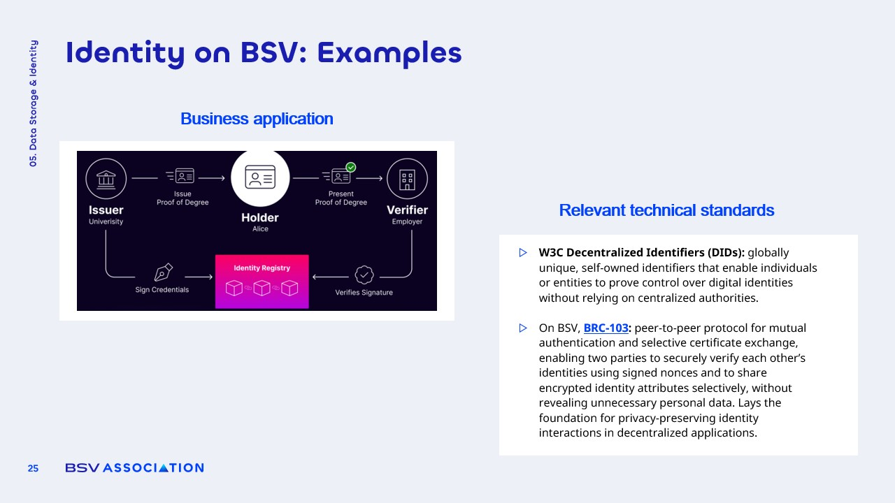

# Standards and Applications

<figure><figcaption></figcaption></figure>

### Examples of Blockchain Identity

**Blockchain-enabled identity solutions** address real-world challenges, such as credential verification.

* **Digital Degrees**: Universities can issue **digital degrees** signed on-chain, allowing graduates to present verifiable credentials to employers.
* **Combatting Fraud**: Helps mitigate issues like **falsified résumés** and unverified professional claims.
* **Trust in Digital Environments**: Provides a reliable source of **trust** amid the rise of AI-generated content.

### Alignment with Global Standards

The **BSV ecosystem** is designed to comply with **international identity standards**, enhancing its credibility.

* **Decentralized Identifiers (DIDs)**: Collaboration with **W3C** to ensure adherence to global identity standards.
* **BRC Protocols**: The **BRC-0103 protocol** facilitates selective certificate exchange, akin to zero-knowledge proofs.
* **Secure Solutions**: Positions BSV as a robust foundation for **secure, private, and verifiable identity solutions** for individuals and institutions.
