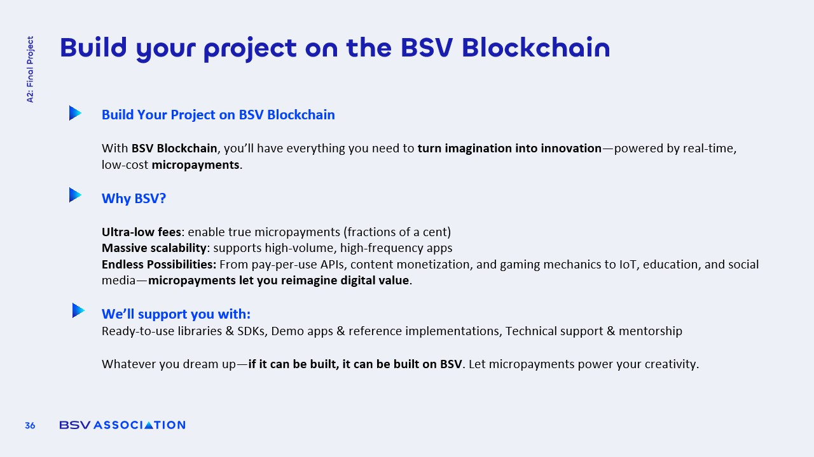

# Build your project on the BSV blockchain

<figure><figcaption></figcaption></figure>

### Invitation to Innovators

The **BSV Association** actively encourages a diverse range of stakeholders, including **entrepreneurs, enterprises, researchers, and students**, to engage in the development of projects, pilots, and **proof-of-concepts (POCs)** on the BSV blockchain.

* Whether you have a **fully formed business idea** or are simply interested in exploring the potential of **blockchain technology**, the Association is here to assist.
* The Association provides **guidance and technical support** tailored to your specific needs, ensuring that you have the resources necessary to succeed.
* Innovators are invited to leverage the **stability and scalability** of the BSV blockchain to test and validate their concepts.

### Collaboration Opportunities

The BSV Association offers various **collaboration opportunities** designed to foster innovation and practical application of blockchain technology.

* Businesses can partner with the Association's **technology, policy, and education teams** to co-develop POCs and case studies that demonstrate **real-world applications** of blockchain.
* Universities and students are encouraged to engage in **collaborative research projects** that can lead to applied learning experiences and valuable insights into blockchain technology.
* These partnerships not only enhance the **learning experience** but also contribute to the broader ecosystem of **blockchain innovation**.
