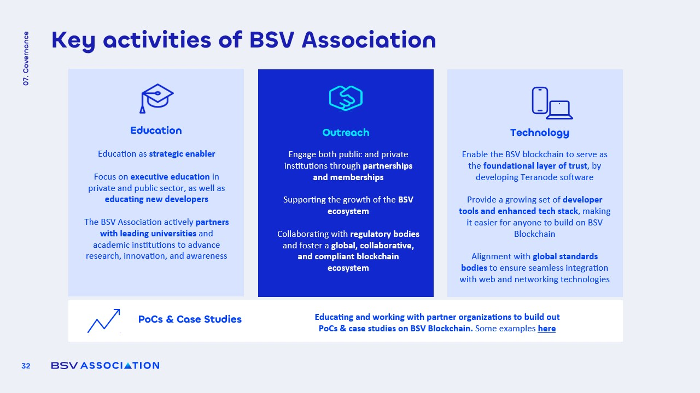

# Key activities of the BSV Association

<figure><figcaption></figcaption></figure>

### Focus Areas

The BSV Association concentrates on several key areas to drive its mission forward:

1. **Education**
   * Collaborates with universities in **Zurich, London, Spain, and Poland** to promote blockchain education.
   * Plans to launch a new **online learning platform**, replacing the previous BSV Academy.
   * Focuses on **business, policy, and developer education** through various initiatives, including summer schools and global outreach.
2. **Outreach**
   * Builds partnerships with technology companies such as **Amazon, Aerospike, and Halborn**, as well as blockchain trade associations.
   * Operates a **global ambassador program** with over 40 ambassadors advocating for BSV use cases.
   * Supports ecosystem growth by facilitating **collaboration among enterprises** utilizing BSV.
3. **Technology**
   * Develops **node software** and **overlay networks** to simplify the building process on the BSV blockchain.
   * Promotes **Simplified Payment Verification (SPV)** as a foundational element for scalable global adoption.
   * Provides **reference implementations, demos, and proof-of-concept projects** in collaboration with businesses.

### Role of the Association

The BSV Association plays a crucial role in the blockchain ecosystem:

* It **coordinates and enables adoption** without controlling the blockchain itself, which remains a public entity open to all.
* The association's efforts are directed towards making it easier for individuals and organizations to **understand, access, and build** on the BSV blockchain.
* It focuses on **practical applications**, emphasizing real-world business pilots and case studies rather than speculative activities related to coin price.
* By creating **libraries and reference implementations**, the association aims to lower the barriers to entry for developers working with **Bitcoin Script-based technology**.
