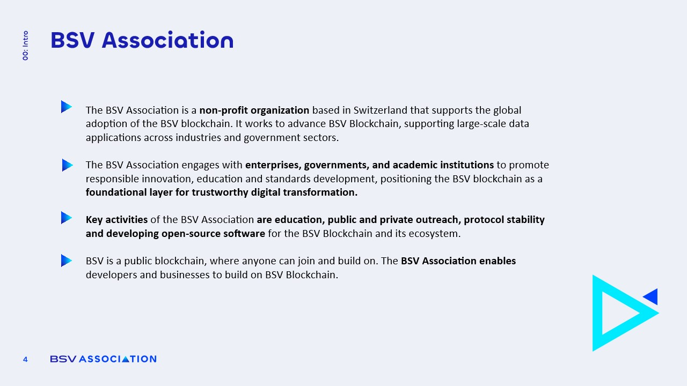

# Organization and Mission

<figure><figcaption></figcaption></figure>

The [**BSV Association**](https://bsvassociation.org/) is a nonprofit organization based in **Zug, Switzerland**. Its primary mission is to **facilitate the adoption of the BSV blockchain** through various initiatives.

* The association emphasizes **education**, **developer relationships**, **protocol stability**, and the **enhancement of the technology stack**.
* It aims to **raise awareness** about blockchain technology and promote its adoption across different sectors.
* The organization collaborates closely with businesses to encourage the use of BSV and works with public policy bodies to foster a **supportive regulatory environment**.
