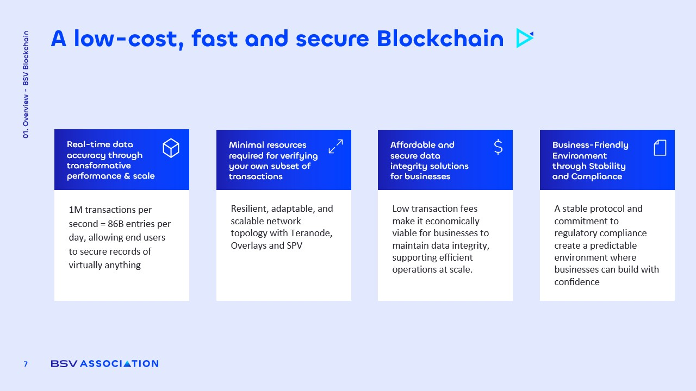

# Business-Oriented Attributes

<figure><figcaption></figcaption></figure>

### Real-Time Data Accuracy

BSV is designed to deliver **real-time data accuracy**, which is essential for various applications. Its transformative performance and scale provide:

* **Unprecedented Capacity**: The network's capability to manage massive transaction volumes ensures that data remains **accurate and verifiable**.
* **Diverse Use Cases**: From financial transactions to supply chain events, BSV can secure records of virtually **any activity**.
* **Immediate Verification**: Users can trust that the data recorded on the blockchain is **transparent and instantly verifiable**.

### Minimal Resources for Tx Verification

BSV’s resilient and adaptable network topology, powered by Teranode, Overlays, and Simplified Payment Verification (SPV), ensures scalability while **allowing users to verify only the transactions relevant to them.**&#x20;

This efficiency **reduces resource requirements**, empowering businesses and individuals to maintain control without the need for heavy infrastructure.&#x20;

### Affordable Data Integrity

The BSV blockchain offers **cost-effective solutions** for maintaining data integrity, making it appealing for businesses. Key features include:

* **Ultra-Low Transaction Fees**: Transactions are measured in fractions of a cent, enabling organizations to preserve data integrity without a significant financial burden.
* **Predictable Costs**: The minimal fees allow enterprises to confidently embed blockchain technology into their operations.
* **Scalable Solutions**: BSV's architecture supports large-scale data integrity solutions, making it feasible for businesses of **all sizes**.

### Stability and Compliance

BSV's commitment to **stability and regulatory compliance** creates a favorable environment for businesses. Important aspects include:

* **Predictable Framework**: The stable protocol allows enterprises to innovate without the fear of **disruptive changes**.
* **Regulatory Alignment**: BSV's strong focus on compliance ensures that legal and technical frameworks support **long-term growth**.
* **Confidence in Integration**: Businesses can integrate blockchain solutions with assurance, knowing that the environment is conducive to **sustainable development**.
