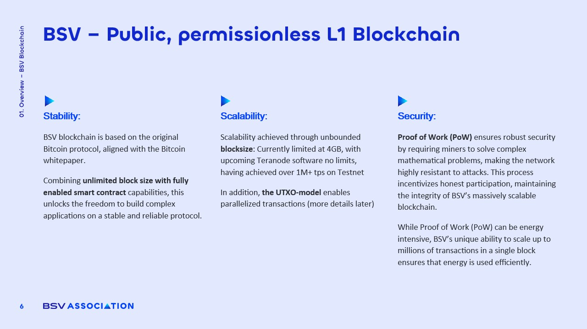

# Core Features of BSV Blockchain: Stability, Scalability, Security

###

<figure><figcaption></figcaption></figure>

### Stability and Fixed Protocol

The **BSV blockchain** is characterized by its **stable and immutable protocol**, designed to remain "set in stone." This stability sharply contrasts with other blockchains, such as **BTC**, which frequently undergo protocol changes. Key points include:

* **No Disruptive Changes**: Businesses can build applications without the risk of sudden protocol alterations.
* **Unlimited Block Size**: Unlike BTC's one-megabyte limit, BSV allows for **blocks of any size**, facilitating greater transaction capacity.
* **Historical Performance**: BSV has successfully produced **four-gigabyte blocks** on the mainnet and achieved blocks as large as **110 gigabytes** on the testnet.

### Scalability with Large Blocks

BSV's architecture supports **exceptional scalability**, primarily through its **unlimited block size** and the **UTXO (Unspent Transaction Output)** model. This design offers several advantages:

* **High Transaction Throughput**: The ability to process up to **one million transactions per second** translates to **86 billion records daily**.
* **Efficient On-Chain Processing**: Larger blocks enable the network to handle a high volume of transactions directly on-chain, reducing reliance on **second-layer solutions**.
* **Enhanced User Experience**: Users benefit from **faster transaction confirmations** and **lower latency**, making BSV suitable for **real-time applications**.

### Security via Proof-of-Work

Security on the BSV blockchain is maintained through a robust **proof-of-work mechanism**. This approach has several implications:

* **Decentralized Control**: Unlike proof-of-stake systems, mining power in proof-of-work only influences the likelihood of block discovery, not governance control.
* **Energy Efficiency**: As transaction throughput increases, the **energy cost per transaction decreases**, making proof-of-work more sustainable.
* **Resilience Against Attacks**: The proof-of-work model provides a strong defense against potential attacks, ensuring the **integrity and security** of the network.
