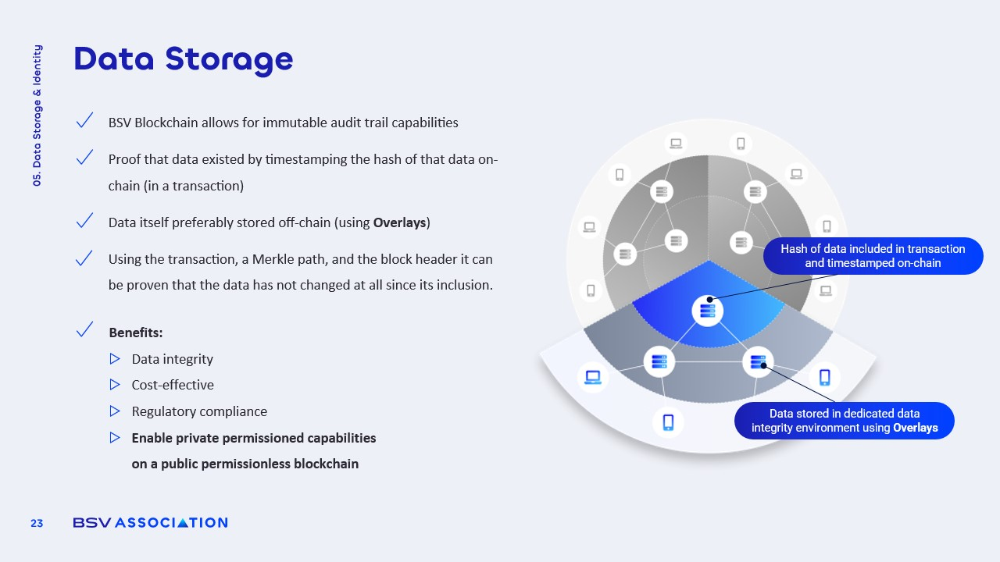

# Data Storage on BSV Blockchain

<figure><figcaption></figcaption></figure>

### On-Chain Data Storage or Not?

The BSV blockchain enables the **storage of various types of data directly on-chain**. This capability is particularly beneficial for use cases that require **immutable records**. However, the decision to store data on-chain should be guided by specific needs and **economic considerations**.

* **Immutability**: Once data is recorded on the blockchain, it **cannot be altered**, ensuring a permanent record.
* **No Size Limitations**: Technically, there are no inherent limits on the size of data that can be uploaded, although **practical constraints** exist.

Despite these advantages, storing large files directly on-chain can be **costly and inefficient**, leading many businesses to consider alternative methods.

### Off-Chain Data Storage

Off-chain storage involves keeping the actual data **outside the blockchain** while anchoring its hash on-chain. This method is often more **efficient and cost-effective**.

* **Storage Solutions**: Data can be stored in Overlays, private servers, or other systems, allowing for **flexibility in data management**.
* **Hashing**: Only the hash of the data is stored on-chain, which preserves the **integrity of the data** while minimizing costs.
* **Merkle Proofs**: Verification of data integrity can be achieved through **Merkle proofs**, allowing independent verification that the data has not been altered since its inclusion on the blockchain.

This approach enables organizations to maintain **control over their data** while still leveraging the benefits of blockchain technology.

### Cost and Efficiency

The **economic rationale** for data storage on the BSV blockchain is crucial for organizations looking to implement blockchain solutions.

* **Reduced Fees**: Storing only hashes on-chain significantly **lowers transaction costs** compared to storing large datasets.
* **Scalability**: Off-chain storage solutions can **scale more easily** to accommodate growing data needs without incurring high blockchain fees.
* **Resource Allocation**: Organizations can allocate resources more effectively by managing data off-chain while utilizing the blockchain for **verification**.

This balance between on-chain and off-chain storage allows for a more **sustainable approach** to data management.
