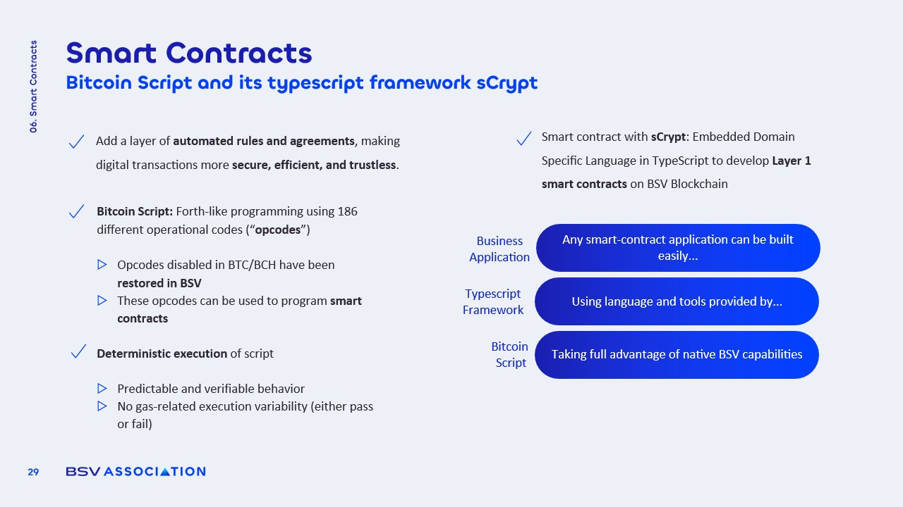

# Smart Contracts on BSV: sCrypt

<figure><figcaption></figcaption></figure>

### Bitcoin Script Features

Smart contracts on BSV utilize **Bitcoin Script**, a stack-based programming language with unique characteristics:

* **Restored Opcodes**: Many opcodes that were disabled in other Bitcoin forks are re-enabled, allowing for **complex logic**.
* **Deterministic Execution**: Contracts execute predictably, either succeeding or failing **atomically** without mid-execution failures.

This **reliability** is crucial for developers looking to create robust applications on the blockchain.

### sCrypt Framework

The **sCrypt framework** enhances the usability of Bitcoin Script by allowing developers to write contracts in **TypeScript**. Key features include:

* **Simplified Development**: Developers can leverage familiar TypeScript syntax, making the **learning curve** less steep.
* **Compilation to Script**: Contracts written in TypeScript are compiled into Bitcoin Script, streamlining the **deployment process**.

This framework significantly lowers the **barrier to entry** for creating smart contracts on BSV.

### Benefits of BSV Smart Contracts

BSV smart contracts offer numerous advantages that make them appealing for developers and businesses:

* **Low Transaction Costs**: The cost of executing contracts is minimal, often just a **fraction of a cent**.
* **Scalability**: BSV's architecture supports **high transaction throughput**, making it suitable for large-scale applications.
* **Predictable Execution**: The deterministic nature of BSV contracts ensures that outcomes are **consistent and reliable**.

These benefits position BSV as a strong contender for businesses looking to implement **blockchain solutions**.
