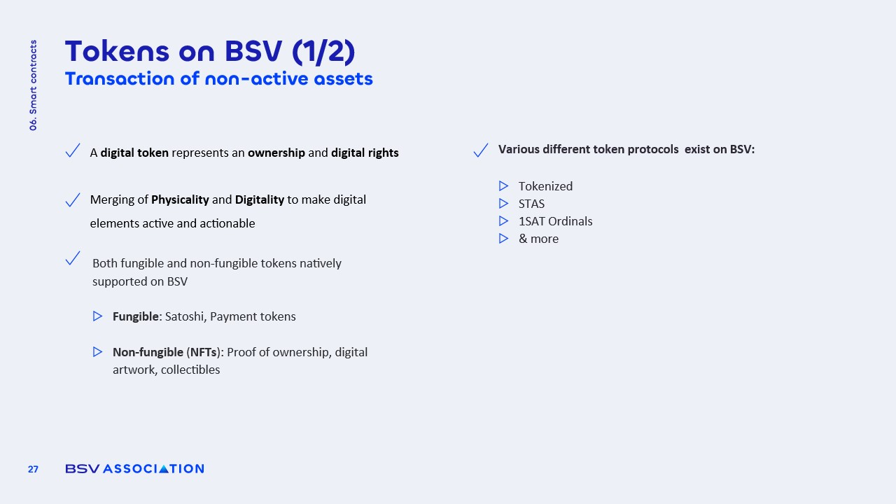

# Tokens on BSV

<figure><figcaption></figcaption></figure>

### Fungible Tokens

Fungible tokens on the BSV blockchain are **identical and interchangeable units**, akin to traditional currencies. They can represent various digital assets, including:

* **Satoshis**: The smallest unit of Bitcoin, enabling **microtransactions**.
* **BSV Tokens**: Tokens that can be utilized for transactions, trading, or as a **store of value**.

These tokens facilitate **seamless transactions** and can be easily exchanged without loss of value, making them ideal for **everyday use** in digital economies.

### Non-Fungible Tokens

Non-fungible tokens (NFTs) on BSV represent **unique assets**, providing proof of **ownership and authenticity**. Key aspects include:

* **Digital Twins**: NFTs can serve as digital representations of physical items, such as art or collectibles.
* **Provenance and Authenticity**: They verify the **originality of assets**, which is crucial in luxury markets to prevent fraud.

Unlike many NFTs on other blockchains that rely on external links, BSV allows data to be **stored directly on-chain**, ensuring **permanence and integrity** of the asset's information.
