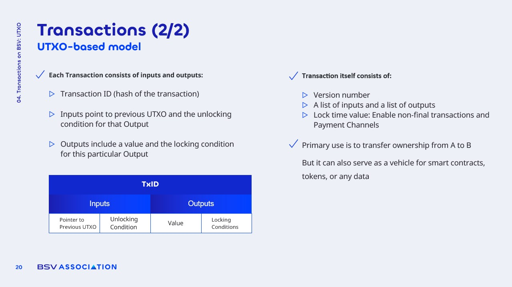

# UTXO-Based Model

<figure><figcaption></figcaption></figure>

### Comparison with Account-Based Systems

The UTXO model differs significantly from **account-based systems**, such as those used in traditional banking or other blockchain architectures.

* In account-based systems, transactions rely on **updating a single account balance**, which can create scalability bottlenecks.
* The UTXO model eliminates the need for a **shared state**, as each UTXO is uniquely consumed, preventing **double-spending**.
* This independence allows for greater **throughput and efficiency**, as transactions do not interfere with one another.
