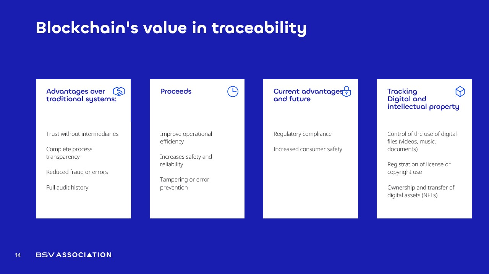

# Blockchain's Value for Traceability​

<figure><figcaption></figcaption></figure>

Blockchain brings a completely new level of **trust and reliability to traceability.**&#x20;

Unlike traditional systems, where intermediaries and closed databases create points of failure, **blockchain removes the need to rely blindly on third parties**. Every transaction and data entry is visible to all participants, creating **complete transparency**. This means that fraud, intentional data manipulation, and hidden errors become far more difficult, as the technology maintains a full and immutable audit history.

**Real-world examples show why this matters.** There have been cases where supply chain data was altered to hide contamination in food products, resulting in massive recalls and financial losses. In other cases, companies have falsified quality control reports to meet deadlines, leading to defective goods reaching customers. With blockchain, these issues could be prevented, as any change to the data would be immediately visible to all stakeholders and permanently recorded with a timestamp, making tampering nearly impossible.

The benefits are immediate. Operations become **more efficient** because everyone works with the same verified information, **improving safety and reliability** across the board. **Regulatory compliance** becomes easier, as all required records are already stored in a transparent, verifiable system. **Consumer safety** also improves because traceability ensures that if a problem is found for example, a defective batch of medicine the source can be identified instantly and the issue contained before it spreads.

Beyond physical products, blockchain is also transforming the **protection of digital and intellectual property**. It allows creators to control the use of their digital files whether videos, music, or documents and register licenses or copyrights directly on the blockchain. Ownership of **digital assets such as NFTs** can be transferred securely, with all rights and history preserved. In a world where piracy and unauthorized use are constant threats, this offers a **new level of protection and proof of ownership**.

_In short, blockchain replaces fragile trust with verifiable truth, reduces risks, protects both businesses and consumers, and creates a foundation where transparency and security are the default._
