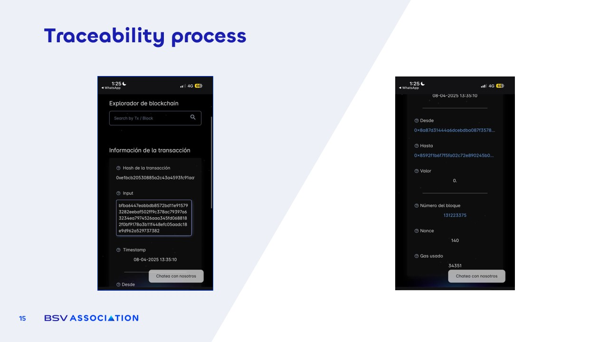

# Example: Traceability Process

<figure><figcaption></figcaption></figure>

In the example above, we see a real **traceability process applied by Ford to one of its vehicles**. The blockchain record corresponds to a car window that has been tokenized. The information stored includes **a hash of a video** showing the full manufacturing process of that window, along with **detailed specifications** such as its serial number, production date, and technical attributes. All of this is recorded immutably on the blockchain, ensuring that it cannot be altered or falsified.

For Ford, this system guarantees **complete transparency and quality control**. At any moment, they can prove the authenticity of the part, trace it back to the exact production batch, and confirm that it meets all manufacturing standards. If a defect is ever reported, they can instantly identify the source, the materials used, and even the specific factory where it was produced.

For the manufacturer of the window, this system provides **undeniable proof of the quality and origin of their work**. It protects them from false claims, ensures they receive proper credit for their production, and builds trust with both Ford and end customers.&#x20;

This is a clear example of how blockchain traceability not only increases operational efficiency but **also strengthens relationships between companies by replacing blind trust with verifiable proof.**
