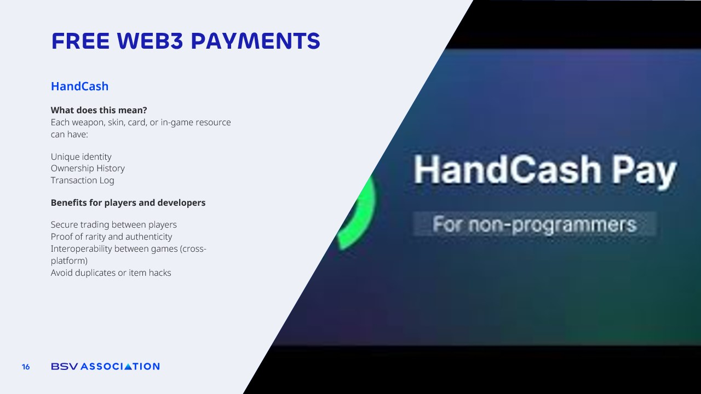

# Free Web3 Payments

<figure><figcaption></figcaption></figure>

HandCash is a wallet built on the BSV blockchain that makes it simple to create and use digital assets in games and other interactive environments.&#x20;

In traditional gaming systems, items like weapons, skins, or collectible cards are **locked inside the game’s servers**. Players never truly own them, and if the game shuts down or an account is banned, **everything is lost.**&#x20;

With HandCash, each in-game item can have a unique identity, a complete ownership history, and a permanent transaction log on the blockchain.

This means **secure trading between players** without the need for centralized intermediaries. **Proof of rarity and authenticity** is guaranteed, making it impossible for someone to create fake or duplicated items. It also enables **interoperability between different games and platforms**, so an item you earn in one game could be recognized and used in another. Something unthinkable in most gaming ecosystems today!

There have been countless **examples of players losing valuable digital items** because of hacks, server errors, or even developer decisions. Entire in-game economies have collapsed after **rare items were duplicated by exploits**, destroying their value. HandCash, combined with blockchain technology, eliminates these risks by **recording each asset immutably, ensuring its scarcity and protecting its value.**

**For developers**, it opens up **new revenue models and more engaged communities**, as players gain real ownership over their assets and feel more invested in the game.&#x20;

**For players**, it transforms virtual goods into **real, tradeable assets** that they can buy, sell, or use across multiple experiences.&#x20;

This is the next step in merging gaming with true digital ownership.
