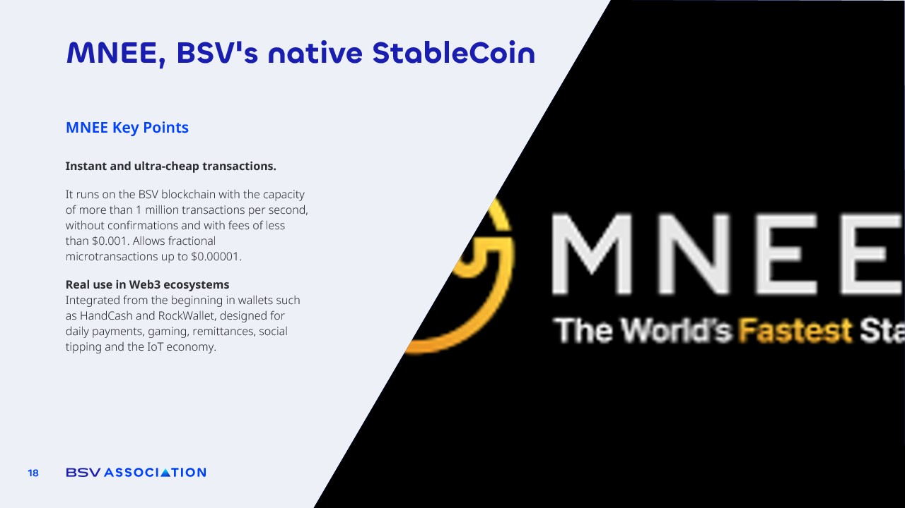

# MNEE, BSV's native StableCoin​

<figure><figcaption></figcaption></figure>

MNEE builds on the StableCoin concept by using the **BSV blockchain**, which means **transaction costs are a fraction of a cent, transfers confirm in seconds, and records are permanently stored for transparency and compliance.**

This makes it an ideal tool not only for protecting value but also for enabling fast, low-cost payments globally.&#x20;

Example: Imagine a merchant in Buenos Aires accepting a payment from a customer in Tokyo in seconds, without paying high fees or worrying about exchange rate volatility. That is the power of combining stable value with blockchain efficiency.

With stablecoins like MNEE, users truly keep both the value and the advantages of blockchain, opening the door to a more reliable, accessible, and global financial system.
