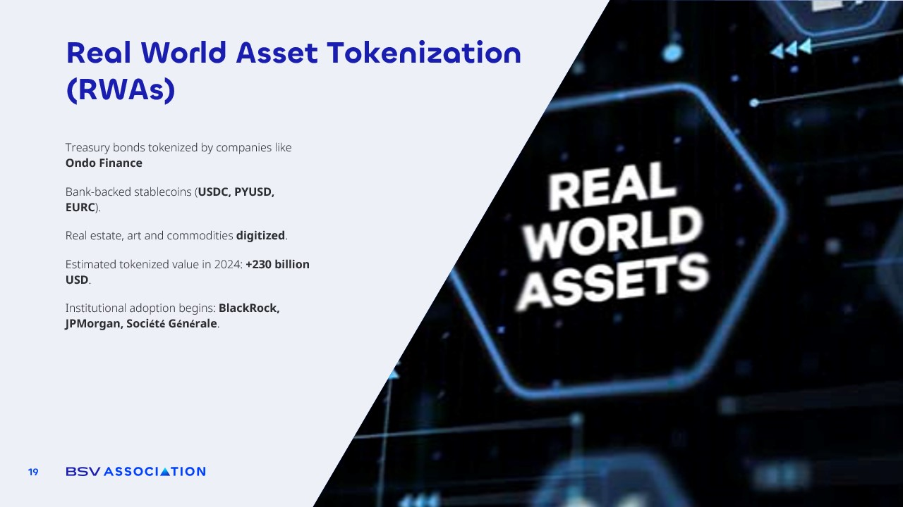

# Real World Asset Tokenisation

<figure><figcaption></figcaption></figure>

**Real World Asset Tokenization, or RWAs,** is one of the most promising applications of blockchain right now. It is the **process of taking physical or traditional assets  such as treasury bonds, real estate, works of art, or commodities and creating a digital representation of them on the blockchain**.&#x20;

**Examples:** Companies like Ondo Finance are already tokenizing treasury bonds, while bank-backed stablecoins such as USDC, PYUSD, and EURC are bridging the gap between traditional finance and blockchain technology.

The numbers speak for themselves. It is estimated that **by the end of 2025, more than 230 billion dollars’ worth of assets will be tokenized.** This is not just a trend among startups; some of the largest financial institutions in the world, including BlackRock, JPMorgan, and Société Générale, have already begun adopting and experimenting with these systems.

The benefits are clear. Tokenization makes traditionally illiquid assets **easier to trade, fractionalize, and manage**.&#x20;

Imagine being able to buy a small percentage of a high-value property in another country, or invest in a piece of fine art without having to be a millionaire. The blockchain ensures that ownership records are immutable and transparent, making fraud or disputes far less likely.

We have seen in the past how paper-based and centralized records can be manipulated. Real estate ownership disputes, forged art certificates, and misreported commodity stocks have cost billions globally. Tokenization on blockchain removes these vulnerabilities, as **every asset’s history, transfers, and proof of ownership are permanently recorded and verifiable by anyone**.

With RWAs, blockchain is no longer just about cryptocurrencies it becomes the infrastructure for the next era of global finance, where any asset, anywhere in the world, can be bought, sold, or traded in a secure and transparent way.
