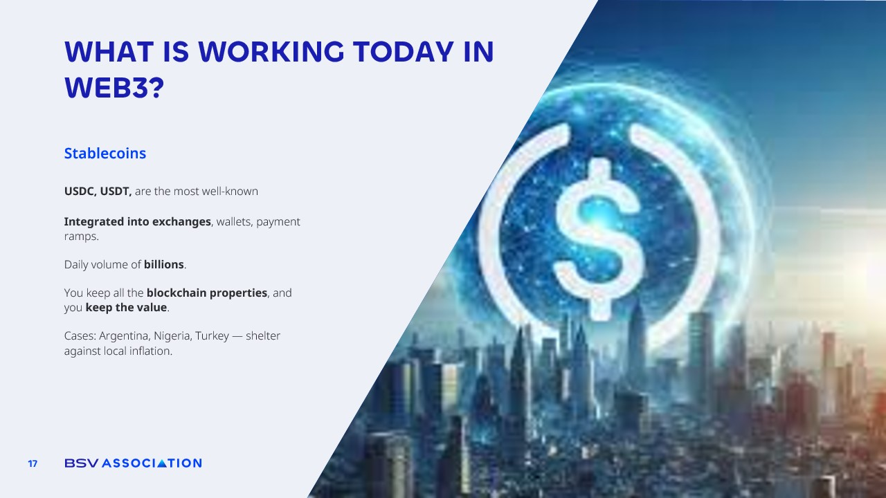

# Stablecoins

<figure><figcaption></figcaption></figure>

Stablecoins are one of the clearest success stories in Web3 today. They combine all the benefits of blockchain technology transparency, security, and instant transfers  with the stability of traditional currency. While well-known examples like USDC or USDT dominate the market, the **BSV ecosystem also has its own solution**: MNEE, a stablecoin designed to **take advantage of BSV’s low fees, high scalability, and instant settlement.**

The value of stablecoins lies in their **ability to keep the price stable while still being fully integrated into exchanges, wallets, and payment platforms**. They move billions in daily transactions around the world, and their role is especially**crucial in countries suffering from high inflation or unstable currencies**. In places like Argentina, Nigeria, and Turkey, stablecoins have become **a shelter for individuals and businesses**, allowing them to store value without losing purchasing power and to make international transactions without the delays or restrictions of the banking system.
