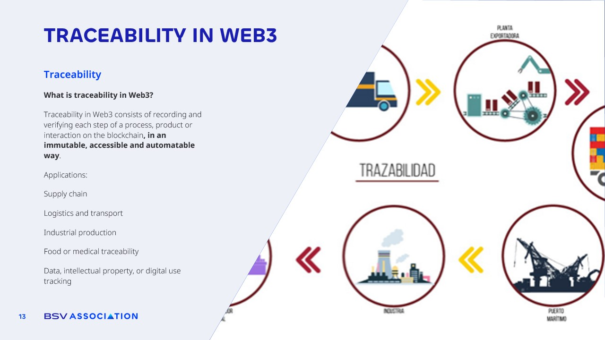

# Traceability in Web3

<figure><figcaption></figcaption></figure>

Traceability is one of the most important aspects and one where blockchain provides a huge advantage.&#x20;

In most modern-day products, several companies are involved in manufacturing, selling, and transporting the product. In many cases there is **no real trust** between them and they have to rely on each other, and of course **they must share data.**&#x20;

**For example**, the product manufacturer must create it and store its information and properties in a database. This information has to be shared with the company that distributes it, and the distributor in turn must inform and share the product data both with the manufacturer to check the status and ensure everything is correct and with the recipient of the product.

At present there are many problems at every stage of the chain:

There are **difficulties in sharing data** because each company uses its own database, must keep it stable and accessible, secure it, and make it scalable.&#x20;

They also have to **trust the data** they receive without really knowing if it has been intentionally modified, as there is no guaranteed trust or integrity and everything is based on simple reliance.&#x20;

Blockchain can solve this. The data is **immutable, it is timestamped,** and it uses hashing, which means that companies **can now verify that the shared data** **has not been altered** after recording. The blockchain is entirely public and accessible to everyone, so there is **no longer the problem of each part of the chain depending solely on its own database**. If any database in the chain fails, the blockchain ensures that the product lifecycle does not have to come to a complete stop.
