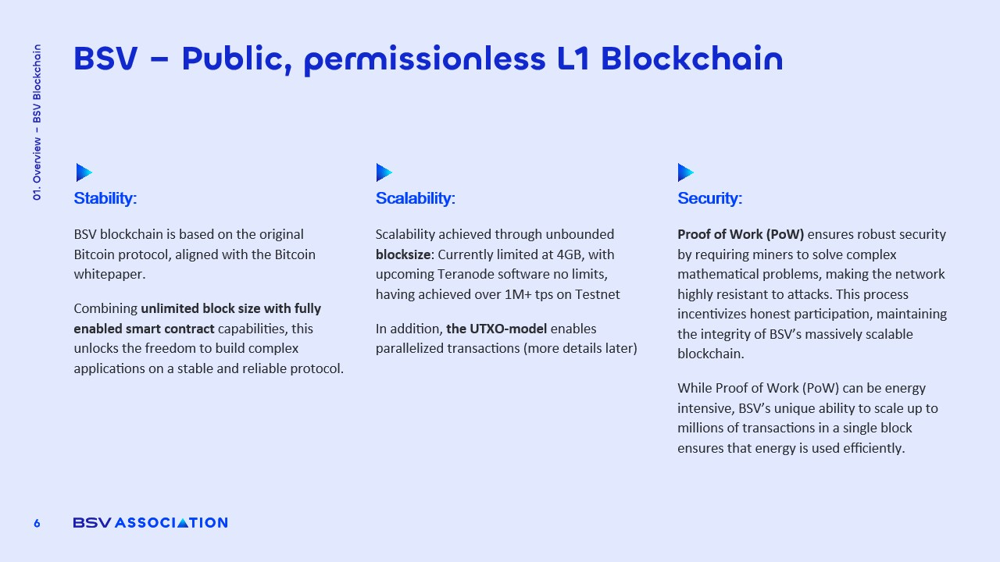

# Blockchain: An immutable, decentralised and transparent data system

<figure><figcaption></figcaption></figure>

But there is a system that aims to solve the problems just described. Before moving forward it is important to clarify the key points of this system.&#x20;

This technology works as a **distributed database**, like a network of computers all connected to each other, each one holding a database with exactly the same information. It is called decentralized because it **does not depend on a single computer**. If there are one hundred computers in the network and one, two, or even twenty go offline, nothing happens, the other eighty remain available.&#x20;

It is considered **immutable because every piece of data stored in this network cannot be deleted or modified** and will remain there forever.&#x20;

It is also considered **transparent** for two reasons:

**First,** anyone with an internet connection can view the contents of this database.&#x20;

**Second,** and very importantly, any data added to this distributed database is always accompanied by a timestamp that shows the exact date it was recorded.

**In broad terms its operation is simple:**

**Anyone can send and store data** in this database. They simply connect to one of the nodes that make up the network, send the data they wish to register, and when the node receives it two important things happen. The data is stored and then sent to all the other computers in the network so they can also store it, because all nodes must have exactly the same information.

On a **more advanced level** this technology operates through **cryptography and hashing mechanisms**, ensuring with complete certainty that the data cannot be altered, preserving its integrity, and verifying both ownership and access in a completely secure way
