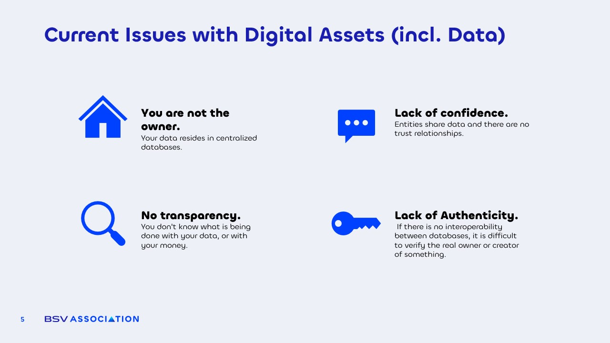

# Current Issues with Digital Assets (incl. Data)​

<figure><figcaption></figcaption></figure>

**You are not the owner of your own data.** Your data resides in centralized databases, and in most cases, you have no access to it and no knowledge of how it is being used. This applies both to your personal information and your money. You do not own your data on Facebook, Google, or Twitter even if their services are free, you and your data are actually the product. Without realizing it, by accepting their Terms of Use, you give these companies permission to trade and monetize your information. The same happens with money: the only form of money you truly own is physical cash. Your bank balance is just a number, but both the government and the bank can deny you access to it, seize it, freeze it, or impose limits.

**There is no transparency.** In systems and services that require openness such as public services people have no access to data, actions, or information about where funds are allocated. For example, in Spain, there was a nationwide power outage lasting an entire day, resulting in deaths of many people. The cause remains unknown because the data and information from the national power grid are not public, even though they should be. Hundreds of millions have been stolen due to a lack of transparency in public administration payments. Reports and payment monitoring are not publicly accessible. The same applies to internal accounts in private companies there is insufficient monitoring to prevent theft, hacking, and illegal fund diversion.

**There is no trust in relationships.** Most products involve more than one company in their creation. These companies must share data, information, and files. But how can we be sure this information is real, unaltered, and that statistics are accurate rather than manipulated? The truth is, we cannot. Currently, companies simply trust and hope they receive genuine data, a situation that has led to fraud, theft, and falsified information damaging the reputation of companies that were not directly responsible but were linked through partnerships with dishonest actors.

**There are serious identity and ownership issues.** In some cases, it is critical to know and verify the true owner of a digital asset. Today’s systems rely on signatures issued by centralized authorities, which are easily manipulated. For example, Meta (Facebook), due to a lack of authenticity in certificates, modified its VPN software to easily listen to and decrypt all the information of millions of users, exposing their personal and private data. This happens because current systems do not use clear, verifiable signatures and rely instead on centralized, easily compromised entities.
