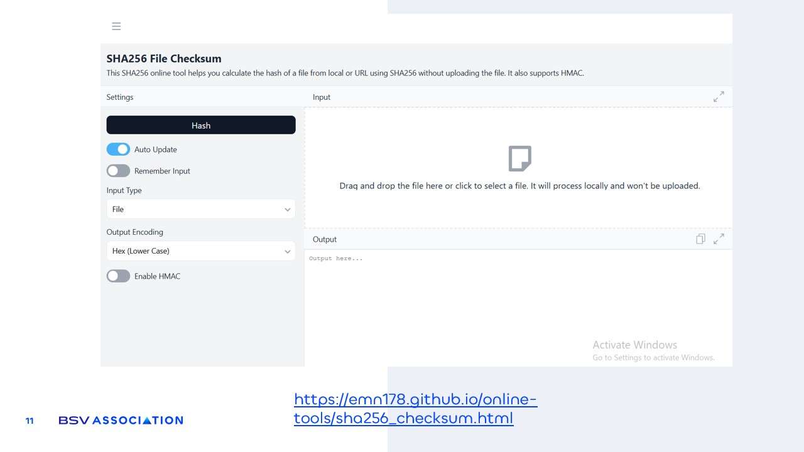

# DIY Hashing example

<figure><figcaption></figcaption></figure>

Hashing can be practiced with online tools like the ones shown in the image. These allow you to **take any file from your computer or enter any text and generate a unique code that represents it**.&#x20;

You can **experiment by changing something in the file or the text and you will see that the result is completely different.** Then restore the original content and you will see that the original unique code appears again.
