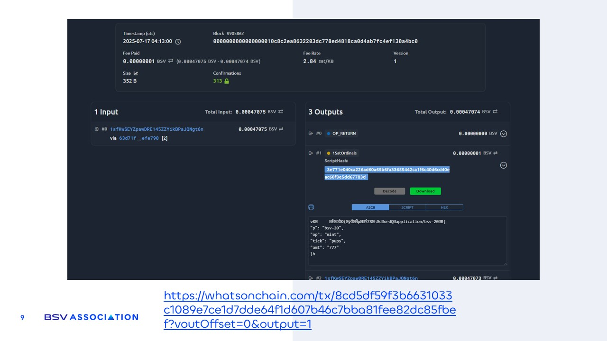

# Tokenization example

<figure><figcaption></figcaption></figure>

In the image above there is an example of a piece of data that has been recorded to the blockchain: [https://whatsonchain.com/tx/8cd5df59f3b6631033](https://whatsonchain.com/tx/8cd5df59f3b6631033c1089e7ce1d7dde64f1d607b46c7bba81fee82dc85fbef?voutOffset=0\&output=1)[c1089e7ce1d7dde64f1d607b46c7bba81fee82dc85fbe](https://whatsonchain.com/tx/8cd5df59f3b6631033c1089e7ce1d7dde64f1d607b46c7bba81fee82dc85fbef?voutOffset=0\&output=1)[f?voutOffset=0\&output=1](https://whatsonchain.com/tx/8cd5df59f3b6631033c1089e7ce1d7dde64f1d607b46c7bba81fee82dc85fbef?voutOffset=0\&output=1) ​

As mentioned before this network is public and anyone can access it. In fact there are tools known as blockchain explorers that allow you to see in real time the data being recorded. **whatsonchain.com** is one of the explorers for the BSV blockchain. The image shows a piece of data that has been recorded and this is what is known as a token.&#x20;

As can be seen in the **Outputs section**, which contains the data recorded in the network, in this case a text has been stored with certain values.&#x20;

In this example **the text simply represents the creation of a new coin and lists all its attributes**, and once these are recorded on the blockchain they can never be changed.&#x20;

Tokenizing is that simple, you have some data that represents something and describes it with its attributes, and you record it on the network.
