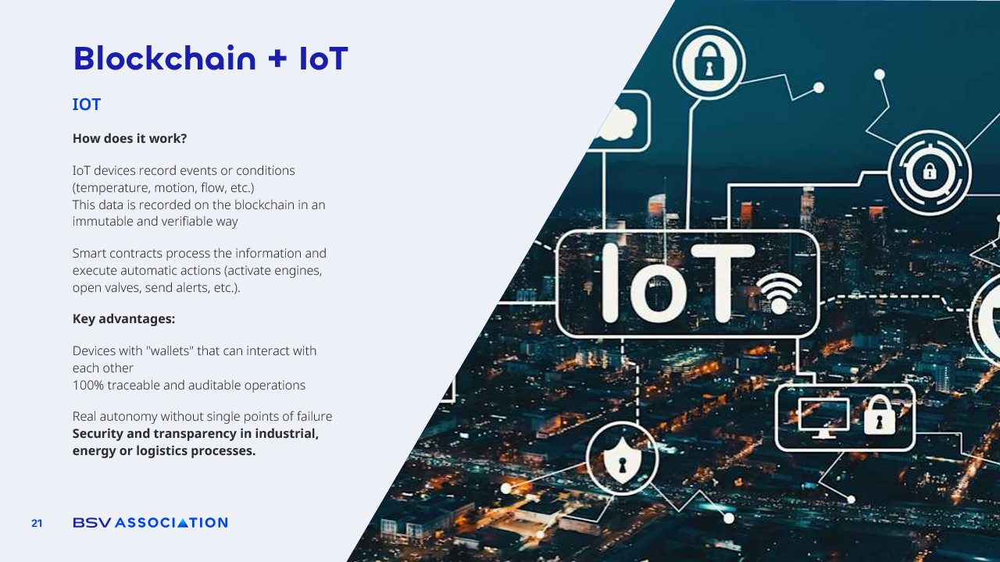

# Blockchain & IoT

<figure><figcaption></figcaption></figure>

The combination of **blockchain and IoT** is opening the door to a new era of **automation, security, and transparency in industrial, energy, and logistics processes**.&#x20;

IoT devices from sensors that measure temperature or motion to meters that track water or energy flow can record events and conditions and send that information directly to the blockchain. Once stored there, the data becomes **immutable, verifiable, and available** for anyone authorized to use it.

**Smart contracts** take this a step further by processing the recorded data and triggering automatic actions. A sensor detecting a rise in temperature could activate a cooling system. A water flow meter could automatically open or close valves. A motion sensor could send an alert in real time if unauthorized activity is detected.&#x20;

All of this happens without human intervention, and every action is permanently logged on the blockchain for auditing!

The benefits are significant.&#x20;

* Devices can have their own “wallets” to interact directly with each other, enabling **fully autonomous machine-to-machine operations**.&#x20;
* Processes become **100% traceable and auditable**
* &#x20;No single point of failure that could compromise the system.&#x20;

In industries like energy production, manufacturing, or supply chain logistics, this means **higher safety standards, fewer delays, and reduced fraud or tampering**.

**Example:** Imagine a logistics network where every container is equipped with IoT sensors recording location, temperature, and handling conditions on the blockchain. If a shipment of perishable goods is exposed to unsafe conditions, the system could immediately flag it, trigger a replacement order, and identify exactly when and where the problem occurred. This is the kind of transparency and efficiency that blockchain and IoT together can deliver.
