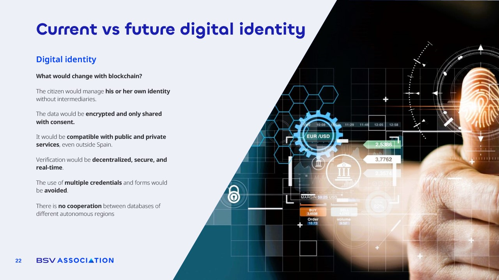

# Current vs Future Digital Identity

<figure><figcaption></figcaption></figure>

**Digital identity** is one of the areas where blockchain can bring the most profound transformation.&#x20;

Today, our personal information is scattered across countless government and private databases, often managed by intermediaries who decide how it is stored and used.&#x20;

With blockchain, **the citizen could manage their own identity directly, without middlemen, keeping full control at all times**.

The **data would be encrypted and only shared with explicit consent**, ensuring that no institution, company, or government can access it without permission.&#x20;

This identity would be **compatible with both public and private services**, even across borders, allowing for international verification without the current bureaucratic barriers.

Verification would be **decentralized, secure, and in real time**. Instead of presenting multiple documents or filling out endless forms, **one verified blockchain-based identity could grant access to multiple services instantly**. This would eliminate the duplication of credentials and the inefficiency of having separate, non-cooperative databases in different regions or agencies.

We have seen **how current systems fail**: databases that do not talk to each other, outdated records leading to denied services, and in some cases, fraudulent identities created to commit crimes or steal benefits. With blockchain, every update or verification is permanently recorded, and any attempt to tamper with the data becomes immediately evident.

This is not only about convenience, but about **building a secure, unified, and citizen-owned identity infrastructure one where your personal information is always under your control, and verification becomes instant, reliable, and universally accepted.**
