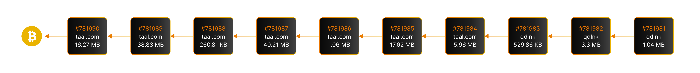

# Blocks

## **Blocks**

We have discussed blockchain as a public ledger, which is made up of a chain of data structures called ‘blocks’. The blocks are linked together to form a continual chain of blocks using cryptography, hence the term "blockchain".

<figure><figcaption>
Chain of blocks, write forward, read backwards
</figcaption></figure>


Explore blocks using the BSV Blockchain explorer, www.whatsonchain.com


### **Block Structure**

Each block is an abstraction which is a container of a group of transactions. A block contains a variable number of transactions and a header, called a block header, which includes the block ID of the previous block, effectively creating a chain.

<figure><figcaption>
Data structure of a block
</figcaption></figure>

The block header contains the following fields:

* **Version.** A 4-byte little endian field indicating the version of the Bitcoin protocol the block is being published under.
* **Previous Block Hash.** A 32-byte little endian field populated by the double SHA-256 hash (HASH-256) of the previous block header
* **Merkle Root.** A Merkle root is the hash of all the transactions included in this block.
* **Timestamp.** A 4 byte field containing the Unix epoch timestamp applied to all transactions in the block. Current network policy only requires this value to be accurate to within 2 hours of the validating nodes’ local timestamp. The timestamp has a 1 second precision.
* **Bits/Difficulty.** The difficulty is a 4 byte field containing the difficulty target value of the proof-of-work puzzle; determined by the network rules.
* **Nonce.** ‘Number Used Once’. The nonce is the 4 byte field that is cycled through during the proof-of-work hashing process to find a proof-of-work solution.

### **Merkle Tree**

The block arranges transactions in a specialised structure known as a Merkle Tree. The root of the Merkle Tree is a single value that protects the integrity of every transaction in that block. This value is stored in the block header as Merkle Root, as shown in the diagram below.

<figure><figcaption></figcaption></figure>

The Merkle tree is the original implementation of a hash tree, proposed by Ralph Merkle in 1979, which is typically interpreted as a binary hash tree. Merkle trees are formed from multiple data elements (In this case, actual transaction data) by first putting each element through a hash function (the transaction ID) to generate the leaf nodes (shown as TXID in the diagram) at the bottom of the Merkle tree. To generate the upper layers of the tree back to the root node, these leaf node values are then concatenated together as ordered pairs and hashed to form another fixed-length string on the next layer up of the tree toward the single root value.

<figure><figcaption>
Hash Tree
</figcaption></figure>

Each leaf node consists of a hashed data entry, so 'n' data entries would result in 'n' leaf nodes. Moving one up the layers, we combine leaf node values by hashing the concatenation of the two individual values provided at the previous layer. This process is repeated by going level up every time there are two node values until the complete information is captured as a single value known as the Merkle Root. The diagram demonstrates this process for a 4-leaf Merkle Tree.

If there are an odd number of transactions, suppose there is no tx4, the hash 3-4 will be the hash 3-3 by using tx3 hash twice and the same process applies. Demonstrating that a leaf node is part of a given Merkle tree requires computing the Merkle Root value by using the leaf node (TxID) and a set of values of all the other nodes needed to calculate the Merkle Root. The set is also known as Merkle proof.

The Merkle Root protects the integrity of all of the underlying data, as even a change of a single character will lead to a significantly different value of the Merkle Root. In some ways, it represented the checksum of the underlying data. This is why a block header represents the identifier of a group of transactions and ensures the integrity of all the transaction data it contains.

#### Hash Function

Hash mentioned in the above diagram represents a cryptographic hashing function, which is a one-way function i.e. it is easy to calculate the hash value from the original data but computationally infeasible to calculate initial data values from the hash.

<figure><figcaption>
One-Way Hash function
</figcaption></figure>

A cryptographic hash algorithm produces irreversible and unique hashes. The Bitcoin protocol uses the SHA256 hash function extensively. In cryptography and computer science, a Hash or Hashing function can also be considered as a unique digital signature produced by a data block when passed through a mathematical cryptographic function, in this case, SHA256.


Try out an online tool for generating hash for any data payload at [https://academy.bsvblockchain.org/hash-calculator](https://academy.bsvblockchain.org/hash-calculator)


Another important component of blockchain is the concept of the Public-Private key-pair, which is a common tool used to enable the possession of exchanged value on the blockchain and is achieved using PKI or Public Key Infrastructure.

### **Public-Key Cryptography**

Bitcoin (BSV) protocol uses public-private key-pairs extensively to assign possession of native tokens. An important point to note is ownership and possession are two different concepts, and ownership is a legally binding term which requires proof of how the acquisition of said ownership happened. What this means is that all tokens at any given time are associated with a unique locking script (often a private-public key pair) but a single entity can contain more than one key-pair. In fact this is the default method to possess the tokens.

The mechanism is such that the tokens are locked to a public key, and only the owner of the corresponding private key can access the tokens. The process is described in the following diagram.

<figure><figcaption>
Key <strong>pair (</strong>P,p) <strong>and Bitco</strong>in Address
</figcaption></figure>

Every time a new transfer of tokens is made, it creates an output where the tokens will be locked to the next owner's public key.


_Examples of a Private-Public Key-pair and a Bitcoin address_

_`Private Key :`_` `` ``L5EZftvrYaSudiozVRzTqLcHLNDoVn7H5HSfM9BAN6tMJX8oTWz6 `

_`Public Key :`_` `` ``0303e84c3ff84ee8a62f5b008b23d9b6f375b06499f3563e27799a1ad113f51a94 `

`Address : 1L1VSMXbVqDLSB9PPQ9XJBxTftMS3t7xsU`



Learn more about Keys at [https://wiki.bitcoinsv.io/index.php/Private\_Keys](https://wiki.bitcoinsv.io/index.php/Private\_Keys)

