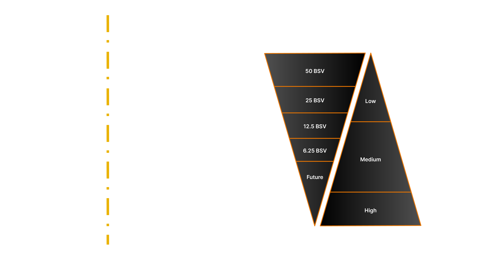

# Economic Model of Governance

The innovation the Bitcoin protocol brought about was an economic system linked to a traceable pseudonymous series of transactions. Proof of Work-based Cryptocurrencies, the concept of a timestamping server, and Distributed Cryptocurrencies have existed for a few decades. Even the concept of a blockchain (hashing a block of information into the next block), was first published 25 years ago.

The Proof-of-Work process needs to be more understood regarding its nature as an _"economic medium": a game theoretic signalling system_. In game theory, you can look at something like a peacock. A peacock signals its health and fitness through the size of its tail. If the tail is too long, it won't be strong enough to get away from predators, and hence it will be killed and unable to breed. Conversely, the peacock with a longer tail tat survives, demonstrates to the females that it is strong because it can survive with a tail of that size. A peacock's tail has value as a signal because it has no real value.

An investment in the PoW is an economic form of signalling. What matters is that the signal is expensive. Proof of Work (as a peacock's tail) is a means of proving the willingness of a party to invest a large sum of money in infrastructure to secure the network by validating transactions and ordering those transactions into blocks, that other miners will validate profitably. As the block reward subsidy vanishes, the transaction fees become increasingly important. In time, a miner who primarily concentrates on something other than ordering transactions will gain little to no remuneration. PoW hashing by itself has no other value, just like the peacock's tail.

Mining nodes signal (with PoW) that they are willing to lose money and take a risk in keeping the network secure. They are willing to pay large sums of money to invest in the network, demonstrating a long-term commitment. Most importantly, it involves a large fixed asset capital base at risk if these miners seek to act outside the law. The biggest control in PoW mining is the **existing legal system**. A miner who decides to act outside of the law with enough hash power to overpower the honest nodes in the network is simple to detect. Most importantly, they provide signed evidence admissible in court and allow criminal prosecutions. Additionally, other miners would legally be able to take action. Action would include anti-competitive behaviour and other protections that are associated with cartel-based action.

Due to this nature, the blockchain system defined by the Bitcoin protocol is not a cryptographic system, but rather an economic system that uses cryptography. Let us understand how this happens further by understanding various concepts involved in the Mining process.

## **Token and its distribution**

A blockchain network is unique in terms of its incentive structure, which involves money built into the network essential for such a public network's security. In the case of BSV Blockchain, the native token is Bitcoin(SV) or simply BSV. It is an abstraction representing the fundamental, indivisible unit of value inside the network known as Satoshi. A single BSV coin is just a denomination representing 10^8 Satoshi.

When the network was launched In January 2009, all native tokens that could be created in this system were issued (specified in the ruleset and codebase). The system has 21 million BSV or 2.1 quadrillions (21,000,000 \* 100,000,000) of Satoshi tokens. At the time of creation or minting of these tokens, the value of all 2.1 quadrillion tokens combined was equal to zero. These tokens gain value based on their utility to enable transacting with the blockchain network. The higher the number of transactions, the higher the utility of the blockchain network giving any value to the token. In short, the token's value is determined by the open market of trade and the utility of these transactions in commercial activities.

These tokens are distributed in the network to its participants via a process called Block subsidy. This mechanism acts as a financial incentive for nodes to perform their function in the network to create blocks by processing transactions. This block subsidy follows a deprecating model where it gets reduced by 50% every four years. The distribution started at 50 BSV in 2009 per Block; currently, it is 6.25 BSV per Block and in 2024 the block subsidy will be halved to 3.125 BSV per Block.

In future, the network will have minimal subsidisation, and the majority of the earnings for nodes will depend on transaction fees. This is illustrated in the following diagram.

<figure><figcaption>
Incentive model in Bitcoin Protocol
</figcaption></figure>

It means the network needs to have as high a volume of transactions as possible to meet the nodes' expenses in offering their services as transaction processors. Supporting this volume of transactions will require that the network is providing usage for the multitude of use cases that a blockchain offers, like micropayments, Central Bank Digital Currencies (CBDC), data transactions and digital contracts.

The flip side of having a native token in the network and using it for transaction fees is the volatility of the token's price and its potential for upsetting the business revenue forecasts and planning. This is an issue in blockchains, where the token prices are a driving force of network participation and a speculative investment asset. In the case of the BSV blockchain (where the transaction fees are typically set to an extremely low value) it need not be a cause for concern. Currently, the transaction fee is 0.05 Satoshi per byte, totalling up to the fees of 1/1000th of a cent for a 300-byte transaction. Even if the price fluctuates significantly, it _is unlikely to_ cause any noticeable impact on a company's budget and revenue planning.

One last aspect of the token system is its limited supply which is frozen with the Protocol. The entire security of blockchain relates to the exchange of tokens. If 100 people want to create entries and there are only 99 tokens, there is an economic incentive to transfer tokens (in transaction fees). There is no incentive if you don't have transaction fees, a token for payment, or something else. In today's market, it is a game of musical chairs where there are a million chairs and only 100 players. In the future, there will be billions of players and only a million chairs. If transactions are based on the exchange of something other than the tokens, and you don't exchange tokens for making an entry, then you have just changed the game by making an infinite number of chairs.

## **Network Consensus**

A Blockchain uses a network consensus methodology (defined in Bitcoin protocol) to determine who can add new blocks. This methodology is specifically designed to make the (mining) nodes become a known public entity. Being a node requires setting up data centres for storing the distributed ledger (currently running into many terabytes) and participating in a computation-heavy process known as Proof-of-Work, which requires machines possessing strong computational power. All this infrastructure means that if, for example, legal action is brought against them, there is an economic cost to these nodes.

There is another reason for such a system design:

> _In a proof of work system, what you did yesterday or what you do today does not determine what you will do tomorrow and hence what you will earn or control tomorrow. The requirement for continuous investment changes the nature of the system in proof-of-work._

The Bitcoin protocol intended to replace trusted intermediaries in a value exchange system with non-trusted ones, which required that these non-trusted entities function honestly. It meant that they are never "at rest". The PoW system described above would strip any entity of any advantage they can get (by being early, influential, etc.). They earn only if they perform "the work" and solve the computation. The implementation of this methodology is quite independent of everything the node needs to do for processing transactions, which is described in detail in the node architecture section.

## **Energy Investment**

The PoW system also requires investment in energy to perform such computation. The energy needed for solving the PoW computation is a function of network difficulty based on a mathematical algorithm that adjusts it to keep the difficulty such that it takes about 10 minutes to solve the computation. If there is a significant computational investment in performing PoW, it will increase the difficulty and vice versa.

Technically, the PoW system is independent of the number of transactions that the network processes in every block. Indirectly, however, it is related to the following economic factors:

1. The number of transactions is directly proportional to the amount earned from fees, and gradually, it will become the primary source of incentive for nodes.
2. The computation done by nodes requires energy, and the more the number of transactions in a block, the less energy is consumed per transaction.
3. PoW removes any possibility of monopolies since it removes any unfair advantages to existing participants.


Nodes governed by the POW system, the public nature of the ledger and the decoupling of identity are the three factors that make a blockchain valuable. These features enable a non-trusted intermediary in a payment system for the first time.


With this background, we will now look at one of the most unique and unusual concepts that the original protocol always intended to be present in the blockchain, but no other blockchain has. The methods and system for a legal jurisdiction to seize assets and issue amendments to records on the blockchain.
