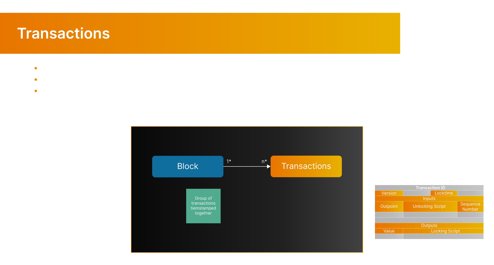
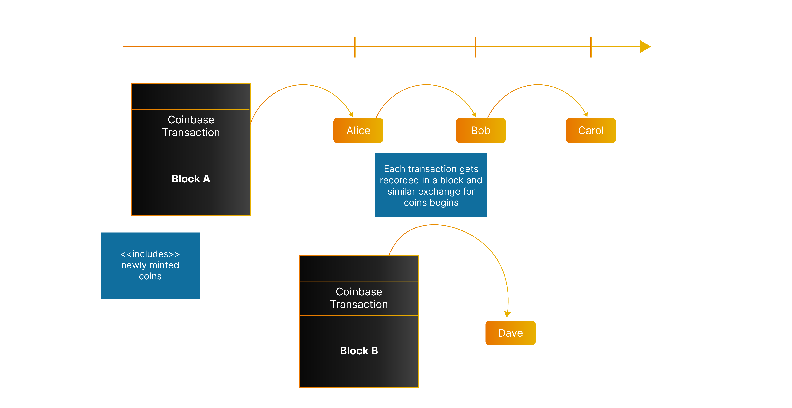
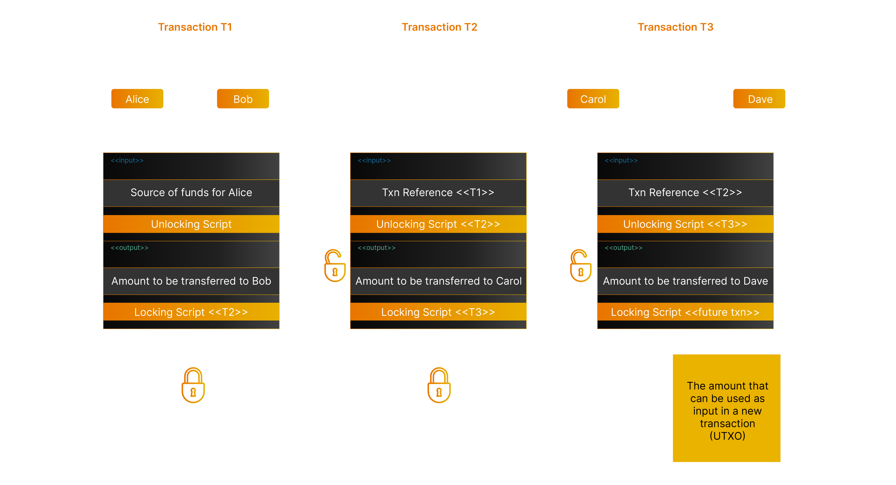
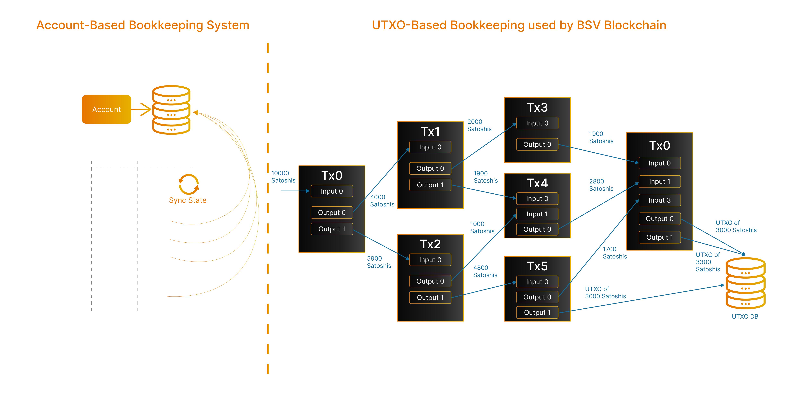
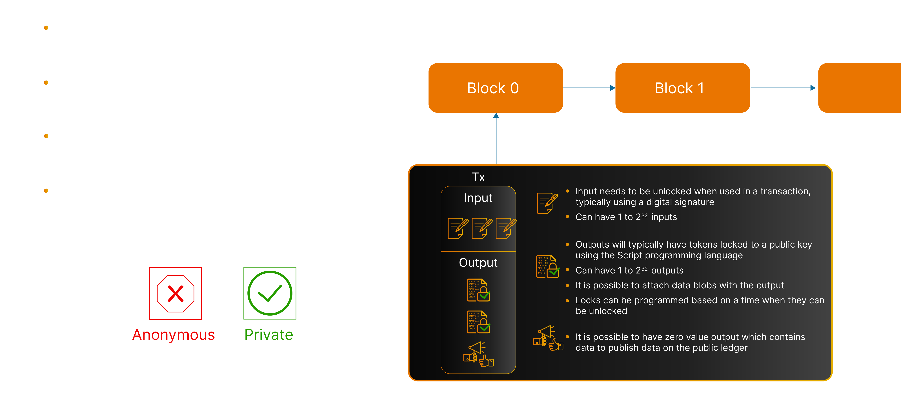

# Transactions

Transactions are events that are recorded and persisted on the public ledger. They are organised into blocks: a group of events that occur over a period of time that are time-stamped together.

<figure><figcaption>
Blockchain Transactions
</figcaption></figure>

Transactions are made up of inputs and outputs. An input will unlock the tokens it intends to spend, transferring ownership of funds from one owner to another. An output will lock tokens to the new owner. Transactions can also be considered electronic contracts that move the ownership of funds from one party to another.

To illustrate this, let’s look at some transactions between Alice, Bob, Carol and Dave. These transactions can be in the same or different blocks and can happen at any time, as shown in the following diagram.

<figure><figcaption>
Transactions moving tokens from Alice to Bob to Charlie
</figcaption></figure>

Alice is represented in the ledger by her public-private key-pair, but her identity is not published. When funds are transferred from Alice to Bob, a transaction is created where Alice provides her digital signature stating that she owns the funds (source of funds for Alice), and that she is transferring the ownership of them to Bob by locking access to them with Bob’s public key.

The transaction itself does not have any identifying information associated with Alice or Bob. The diagram then shows that Bob, who has received funds from Alice, now has the private key able to spend the funds. He uses transaction T2 to transfer the funds to Carol. Carol then transfers the funds to Dave in transaction T3.

<figure><figcaption></figcaption></figure>

The first transaction of every block is called a "Coinbase transaction". This transaction does not have an input and has a single output which acts to bring coins into circulation as a reward for the node which won the right to add the relevant block to the blockchain in a process known as Proof of Work. This reward consists of two components: a block subsidy and transaction fees. See [network-policies](../network-policies/ "mention") and [transaction-lifecycle](../transaction-lifecycle/ "mention") for further details.


Blockchain has two distinct chains, the chain of blocks and many chains of coins. While we have already described the chain of blocks, we look at (many) chain of coins. According to the white-paper - "A coin is defined as a chain of digital signatures". At any point, the coin or the UTXO funds can be traced back to its entire history of transactions spending back to the original Coinbase transaction which brought the tokens into distribution.

The two chains together create an immutable chain of events in time or a time-chain.


Transaction outputs that have not been used as inputs (yet), i.e., spent, are called UTXOs (unspent transaction outputs). Just as in a bank where the total account balance of all accounts represents the total funds present in the bank, in a blockchain these UTXOs collectively represent all the tokens that can be used in subsequent transactions in the system at a given point in time.

The following diagram illustrates this comparison while also describing UTXO creation and end of existence. Blockchains maintain a UTXO database, which stores the current state of all UTXOs that exist at any point in time.

<figure><figcaption>
UTXO Model of accounting defined by Bitcoin Protocol
</figcaption></figure>

There is a significant difference in terms of processing when it comes to Accounts vs UTXO. A single owner can have multiple UTXOs for a single key or even have one keypair per UTXO. Unlike an account, the Identity of the owner is not attached to the UTXO and there is no need to maintain account balances (which is quite normal in account-based systems).

The UTXO model allows a blockchain to parallelise transaction processing, which is a critical factor in scaling a blockchain.


As an analogy, think of a UTXO as being like a banknote; when you have a $100 bill, and you use it to buy something for $50, the original note is handed over and is, therefore, no longer in your possession. In return, you will receive a change of $50, which will be a new note, but the original $100 with your ownership is gone.


In the same way, when you spend a UTXO with 100 satoshis, this will transfer the ownership of 50 satoshis to the new owner, you may perhaps incur 10 satoshis in fees, and a new UTXO of 40 satoshis will be created, which might even be assigned to the same public key that it was spent from originally, but it becomes a new UTXO as the attributes of UTXO change (location of UTXO in a new transaction).


#### **Understanding UTXOs with a safe-deposit box analogy**

Unlike system of accounts, every individual satoshi token is a separate item and a Bitcoin is a series of tokens. Those tokens are put together in an envelope that is referred to as a UTXO. The envelope is then locked in a virtual safe-deposit box in a massive room full of safe-deposit boxes. The safe-deposit box number is the equivalent of the identifier for the public address or public-key associated with most locking scripts. This identifier can be used to hold multiple envelopes or as per the above-mentioned reference, multiple UTXO’s where each envelope holds a series of tokens.

Thus, the safe-deposit box can be used multiple times. Reusing the safe-deposit box means that people can view you going to it, and you lose privacy. for all practical purposes, as many safe-deposit boxes are available to create as needed inside the room.

Satoshi tokens are never lost. As a result, the system always has the same number of tokens as when it was first created. Tokens can be replaced. This can be done in a variety of ways as the ledger is updated. If you lose your keys, it is the equivalent of losing your keys to a safe-deposit box. You can gain access to the safe-deposit box, but that costs money, time and effort. For example, if your safe-deposit box contains $5 and when you lose the keys the cost of regaining access to the keys is $5000, it is very unlikely that you will try and regain access. But if the box contains $5.000.000, you will definitely want to spend the cost and effort to regain access to the box.

Lost tokens don’t break the system. What they do is require people to keep purchase records for larger values/amounts of tokens. The use of the recovery process for small amounts will be impractical, leaving these methods to be only used for the recovery of UTXOs with large amounts. This is because Bitcoin is designed to be cash, and cash is not designed to be a system where you have billions of dollars sitting in a safe-deposit box.


### Transaction Inputs and Outputs

In traditional payment systems, a transaction will have a single input and single output due to the usage of account-based ledgers (Credit, Debit). Bitcoin's UTXO-based ledger allows a transaction to have many inputs and outputs.

Each output contains a predicate (evaluates to true or false) locking script that that must receive the correct missing information in order to evaluate to true when being included as an input in a new transaction. This property makes every transaction an electronic contract when used in conjunction with the public ledger. Locking scripts use a native programming language called Script (colloquially Bitcoin Script), allowing a large variety of electronic contracts to be supported natively.

<figure><figcaption>
Transaction Inputs and Outputs
</figcaption></figure>

These transactions effectively form a chain where the coins start their journey from the time they come into circulation (the first transaction in any block) to where they currently are assigned in terms of ownership (public keys of owners of these coins). This structure is what makes a coin effectively a chain of digital signatures.
